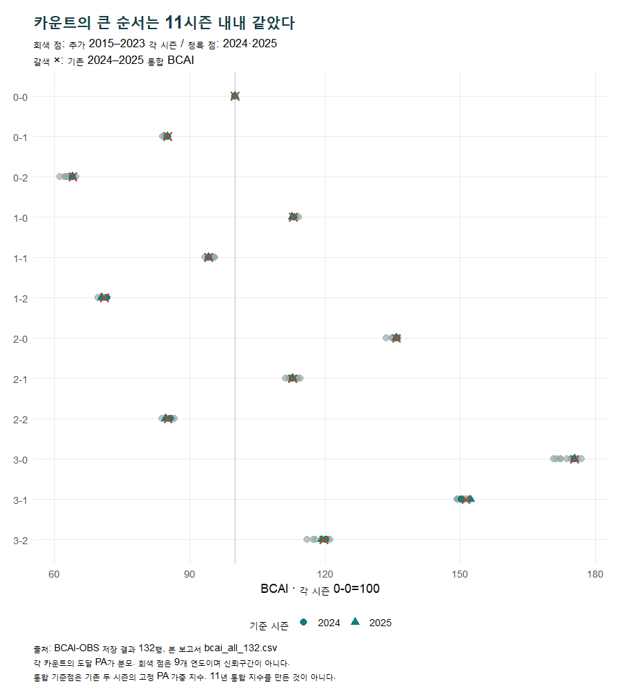
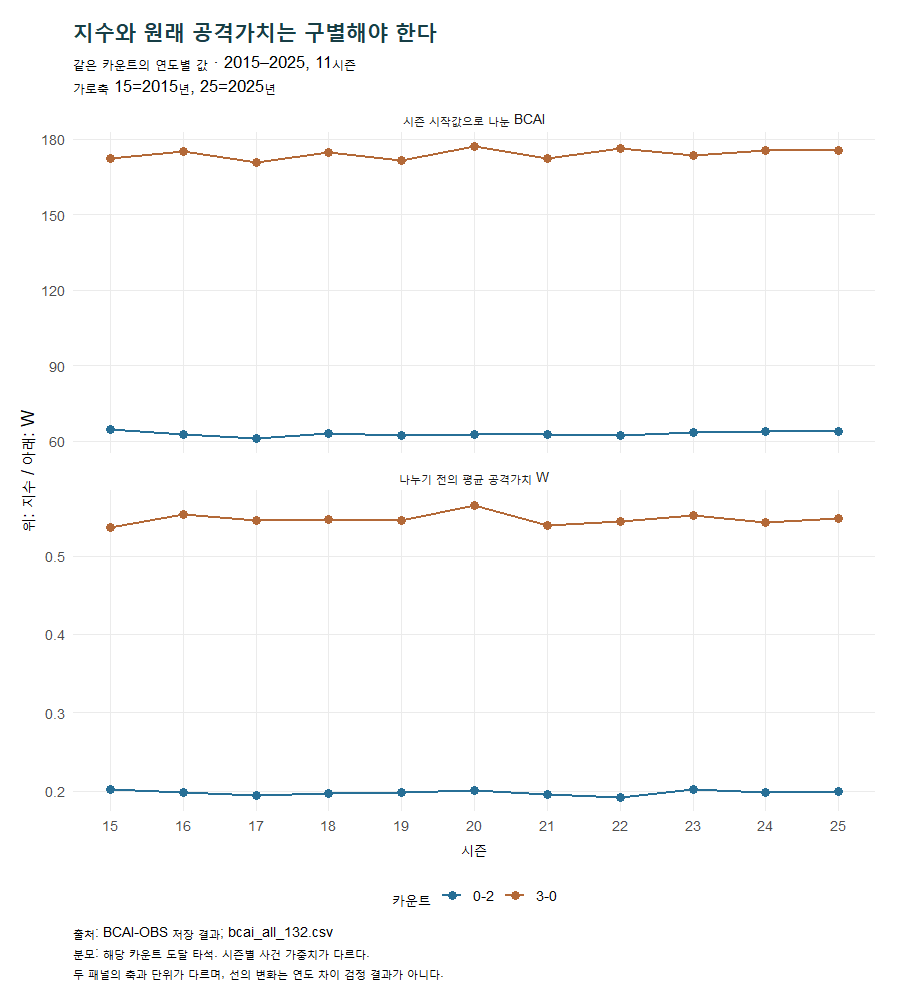
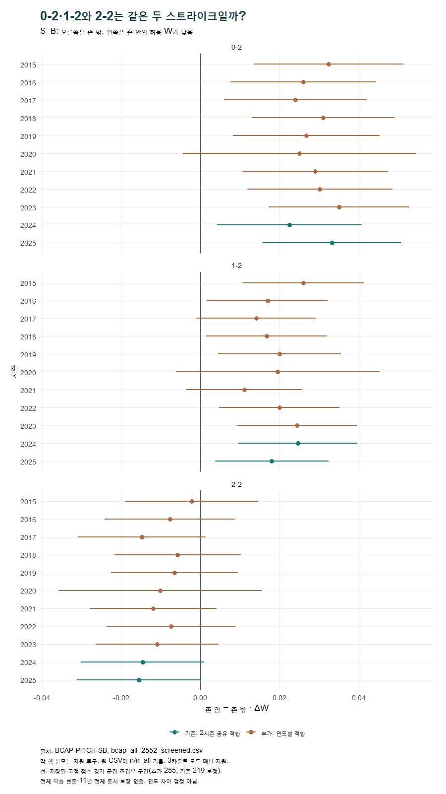
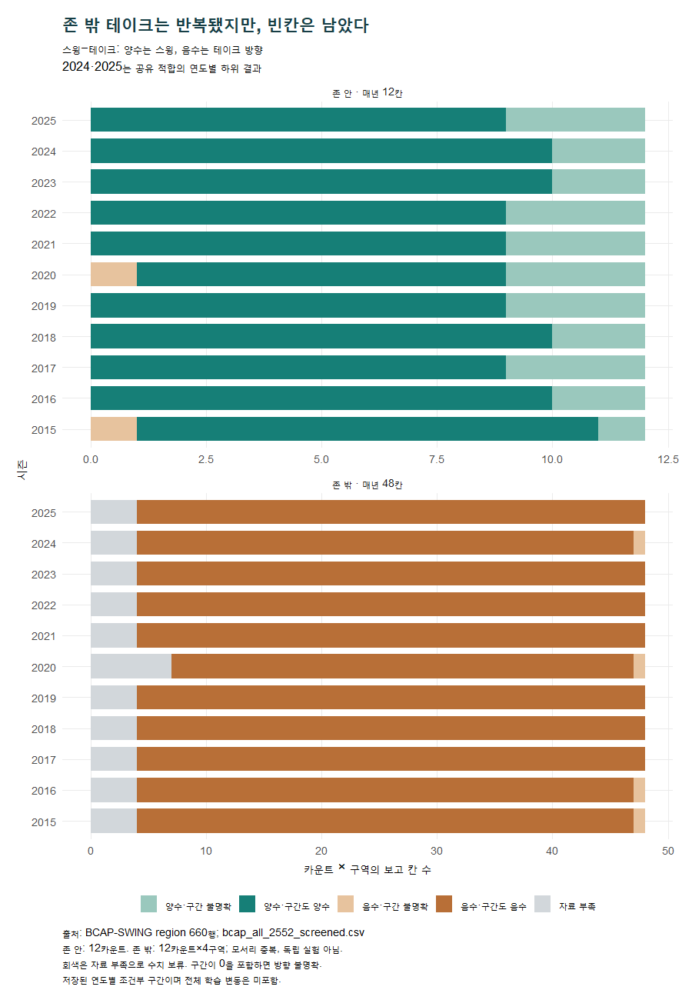
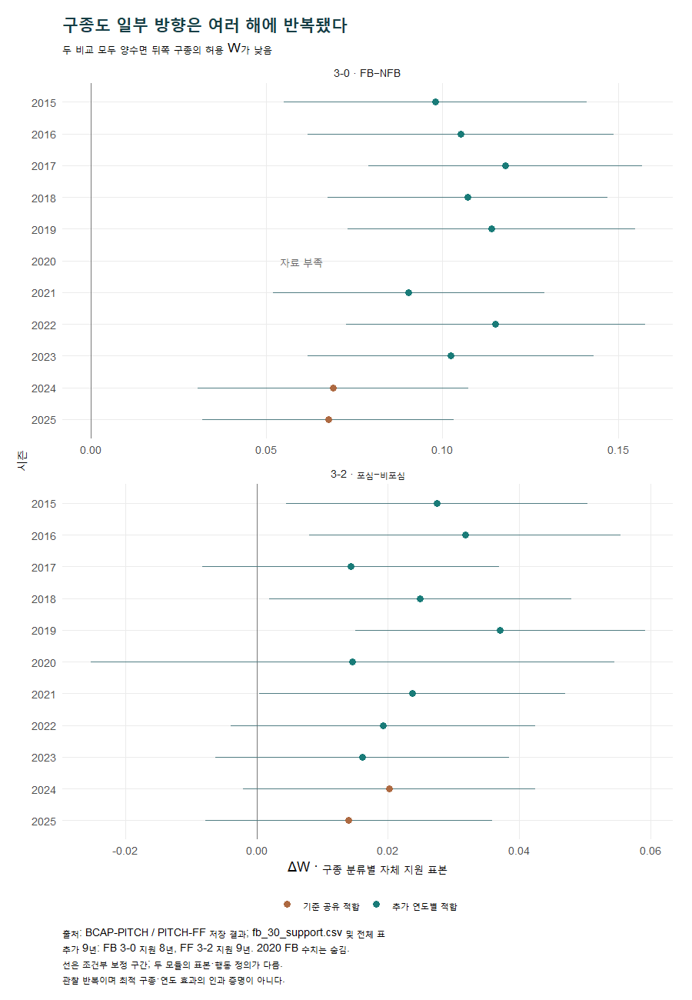

# 두 시즌에서 열한 시즌으로 — BCAI와 BCAP에서 무엇이 달라졌을까?

**2024–2025에서 발견한 모습은 어디까지 반복됐을까? 먼저 답하면, 카운트의 큰 지형과 0-2·1-2의 위치 방향은 넓은 기간에서도 이어졌다. 다만 스윙과 구종의 이야기는 조건을 더 세밀하게 붙여야 한다.**

이 보고서는 기존 원고를 바꾸기 전 읽는 비교 자료다. 2024–2025의 결론을 먼저 고정하고, 추가된 **2015–2023의 9시즌**과 대조했다. 마지막에 **2015–2025의 11시즌**을 함께 정리했다. 두 시즌이 열한 시즌 안에 포함되므로 두 기간을 독립된 표본처럼 맞붙이지 않았다.

## 먼저 알아둘 다섯 가지

1. **BCAI의 큰 순서는 반복됐다.** 추가 9시즌 모두 0-2가 최저, 3-0이 최고였다. 같은 스트라이크 수에서는 볼이 많을수록, 같은 볼 수에서는 스트라이크가 적을수록 지수가 높았다. 기존 두 시즌을 포함해 11시즌 모두 같은 모양이다.
2. **0-2·1-2의 존 밖 방향도 반복됐다.** 추가 9년 모두 비교 지원 기준을 통과했고, 점추정은 두 카운트 모두 9/9년에서 존 밖 방향이었다. 구간까지 같은 방향인 해는 각각 8/9년, 6/9년이었다. 매년 같은 강도로 확인됐다는 뜻은 아니다.
3. **존 밖 테이크는 넓게 반복됐지만, 존 안 스윙에는 예외가 있었다.** 추가 기간의 존 밖 432개 보고 칸 중 393칸을 비교할 수 있었고 모두 테이크 방향이었다. 구간도 같은 방향인 것은 390칸이었다. 존 안 108칸은 모두 지원됐지만, 2015·2020년 3-0은 작은 음수 점추정에 넓은 불명확 구간이었다.
4. **구종의 “대부분 불명확”이라는 결론에는 이제 반복되는 단서를 함께 적어야 한다.** 추가 9년 중 FB/NFB 3-0은 지원된 8년 모두 NFB 방향이고 구간도 양수였다. 포심/비포심 3-2는 지원된 9년 모두 비포심 방향, 그중 5년은 구간도 같은 방향이었다. 특정 구종을 던지라는 지침은 여전히 아니다.
5. **기간을 늘린 효과와 적합·측정 차이를 떼어 말할 수 없는 부분이 있다.** 기준 두 시즌은 공유 모형으로 적합했고 추가 9시즌은 연도마다 따로 적합했다. 2015·2016의 구속 측정, 2020 단축 시즌, 시즌별 가중치와 지원 표본 차이도 남는다. 이번 비교는 기술적·서술적 비교다.

수치의 출발점은 [기존 주장 장부](tables/original_claim_ledger.csv), 전체 선별 결과는 [BCAI 132행](tables/bcai_all_132.csv)과 [BCAP 2,552행](tables/bcap_all_2552_screened.csv)이다. 기존 원고와 완료 실행은 수정하지 않았다.

## 1. 먼저, 예전에는 무엇을 알고 있었을까?

### 새 결과를 보고 옛 결론을 다시 만들어도 될까?

**그렇게 읽으면 과거에 몰랐던 사실까지 처음부터 알았던 것처럼 보인다.** 그래서 [BCAI 기존 분석](../count_advantage_2024_2025.md), [구종 분류 비교](../bcap_pitch_classification_20260912__r01/report.md), [기존 외부 확인의 결론](../bcap_external_20260914__r01/final_column_conclusion.md), 보존된 [본문](../../publish/naver_20260918/01_ball_count.md)·[BCAI 해설](../../publish/naver_20260918/02_bcai.md)·[BCAP 해설](../../publish/naver_20260918/03_bcap.md)을 먼저 읽었다.

옛 원고도 이미 2023년과 2026년 보조 확인을 일부 사용했다. 따라서 이번에 말하는 **“추가 2015–2023”은 기준 창 2024–2025 밖의 증거**라는 뜻이다. 2023을 이번에 처음 보았거나 완전히 미노출된 검증 자료라고 부르지 않는다. 새로운 시간 범위는 특히 2015–2022이며, 2023은 기존 Python 결과와 새로운 R 연도별 실행을 구별한다.

| 당시 확인한 내용 | 당시 근거 | 당시에도 붙였던 범위 |
| --- | --- | --- |
| 0-2 최저, 3-0 최고 | BCAI 63.99와 175.40 | 2024–2025 도달 타석의 관찰 지수 |
| 1-1은 시작보다 낮고, 3-2는 높음 | 94.16과 119.73 | 지수가 승률·득점은 아님 |
| 0-2·1-2의 실제 존 밖 공은 허용 W가 낮음 | 개발 S−B +0.0278, +0.0214 W | 의도한 코스나 심판 판정이 아닌 실제 위치 |
| 존 안은 주로 스윙, 존 밖은 주로 테이크 | 2023 존 안 10/12칸 구간 양수, 존 밖 지원 44칸 음수 | 존 안 3-0·3-1 불명확, 존 밖 3-0 자료 부족 |
| 구종 대부분은 우열 불명확 | 2023·2026 자체·공통 표본 96개 보고 중 92개 | 서로 겹치는 비교, 2026은 시즌 중간까지 |
| 구종에도 제한된 단서가 있음 | 개발 FB/NFB 3-0, 포심/비포심 3-2 | 드문 행동·표본 선택·보정·분할 의존성 |

여기서 **W는 볼넷·단타·장타 등 최종 타석 결과에 시즌별 가중치를 붙인 공격가치**다. 타자에게는 높을수록, 투수에게는 낮게 허용할수록 좋은 방향이다. 0.02 W를 0.02득점이나 안타 확률 2%포인트로 바꾸어 읽지 않는다.

### 표본이 얼마나 늘었나?

**기준은 364,124 유효 타석·4,859경기, 추가 기간은 1,532,768 유효 타석·20,334경기다.** 합쳐서 11시즌 1,896,892 유효 타석·25,193경기다. 이는 BCAI의 시작 타석 분모다. BCAP의 비교 투구 수와 같지 않다.

한 타석은 여러 카운트를 거칠 수 있다. 따라서 열두 카운트의 도달 타석 수를 더해 전체 타석으로 쓰면 중복된다. BCAP도 모듈별 적격 조건과 지원 조건이 달라 분모가 서로 다르다. [시즌별 분모와 시작 W](tables/year_denominators.md), [BCAP 전체 지원 표본](tables/bcap_overall_coverage.csv)에 각각 남겼다.

## 2. BCAI — 카운트의 유불리 지도는 달라졌을까?

### 0-2는 예전에도 가장 어려웠을까?

**추가 9시즌 전부에서 가장 낮았다. 3-0도 9시즌 전부에서 가장 높았다.** 기존 두 시즌까지 합쳐 11/11시즌이 같은 극값 카운트를 보였다. 기간을 늘려 가장 먼저 얻은 것은 큰 순서의 반복이다.

BCAI는 그 카운트를 거친 타석의 최종 평균 W를 각 시즌 0-0의 평균 W로 나누고 100을 곱한 지수다. 아래 표의 기존 값은 원래 정의대로 두 시즌의 시작 타석 비중을 고정해 섞은 지수다. 추가 기간과 전체 기간 열은 **연도별 지수의 최솟값–최댓값**이며 새 통합 지수가 아니다.

| 카운트 | 기존 2시즌 지수 | 추가 9시즌 범위 | 11시즌 범위 | 추가 9시즌 도달 PA 합계 | 11시즌 순위 범위 |
| --- | --- | --- | --- | --- | --- |
| 0-0 | 100.00 | 100.00–100.00 | 100.00–100.00 | 1,532,768 | 7–7 |
| 0-1 | 85.06 | 84.05–85.23 | 84.05–85.23 | 767,610 | 9–10 |
| 0-2 | 63.99 | 61.10–64.78 | 61.10–64.78 | 320,475 | 12–12 |
| 1-0 | 112.96 | 113.00–114.19 | 112.72–114.19 | 595,805 | 5–6 |
| 1-1 | 94.16 | 93.40–95.53 | 93.40–95.53 | 608,870 | 8–8 |
| 1-2 | 71.03 | 69.67–71.25 | 69.67–71.66 | 450,233 | 11–11 |
| 2-0 | 135.86 | 133.61–136.26 | 133.61–136.26 | 203,022 | 3–3 |
| 2-1 | 112.80 | 111.29–114.47 | 111.29–114.47 | 315,962 | 5–6 |
| 2-2 | 85.10 | 83.82–86.59 | 83.82–86.59 | 368,328 | 9–10 |
| 3-0 | 175.40 | 170.75–176.95 | 170.75–176.95 | 62,661 | 1–1 |
| 3-1 | 151.31 | 149.29–152.22 | 149.29–152.34 | 131,549 | 2–2 |
| 3-2 | 119.73 | 116.10–121.08 | 116.10–121.08 | 211,584 | 4–4 |

표의 순위는 타자 공격가치가 높은 순서다. 추가 도달 PA 합계는 같은 카운트 안에서 9시즌의 분모를 합친 값이다. 다른 카운트끼리는 합치지 않는다. 정확한 연도별 W·분모·구간·실행은 [132행 원천 연결표](tables/bcai_all_132.csv)에 있다.

*그림 1. 연도별 점추정을 비교했다. 회색은 추가 9시즌, 청록은 기준 두 시즌, ×는 기존 두 시즌 통합값이다. 범위와 점의 겹침은 연도 차이에 대한 검정 결과가 아니다.*

### 그렇다면 열두 카운트의 순서가 완전히 고정됐다는 뜻일까?

**큰 순서는 같지만, 가까운 두 쌍의 순위는 바뀌었다.** 0-1과 2-2, 1-0과 2-1이다. 옛 원고가 보여준 “값이 가까운 카운트라도 다음 공에 걸린 것은 다르다”는 설명은 유지할 수 있다. 다만 두 쌍이 모든 해에 거의 같은 숫자라고 표현하면 지나치다.

추가 기간의 2-2−0-1 지수 차이는 **−0.852~+1.818포인트**다. 2020년에는 2-2가 아래였고, 다른 추가 8시즌에는 위였다. 2-1−1-0은 **−1.730~+0.691포인트**였다. 2017·2018·2021·2022년에는 2-1이 위, 나머지 추가 5시즌에는 1-0이 위였다. 이는 점추정의 순서이며 차이가 통계적으로 확인됐다는 뜻은 아니다.

기준 두 시즌도 작은 순서까지 같지는 않았다. 2024년에는 2-2가 0-1보다 0.526포인트 높았지만, 2025년에는 0.445포인트 낮았다. 새 자료는 완전히 다른 지도를 만든 것이 아니라, 큰 모양 안에서 가까운 칸의 위치가 조금씩 바뀐다는 점을 보여준다. [연도별 순서와 차이](tables/bcai_year_shape.csv)

### 1-1은 여전히 원점보다 불리했을까?

**11시즌 모두 100보다 낮았다. 반대로 3-2는 모두 100보다 높았다.** 추가 기간의 1-1은 93.40~95.53, 3-2는 116.10~121.08이었다. “볼 하나와 스트라이크 하나면 원점”, “삼진과 볼넷이 모두 하나 남았으니 대칭”이라는 식으로 읽기는 어렵다.

다만 설명용 등급 경계까지 고정됐다는 뜻은 아니다. 예를 들어 1-1의 점추정은 일부 해에 95를 넘었다. **100보다 낮다는 결과와 특정 등급 안에 들어간다는 판정은 구분해야 한다.** 이번 확장은 기존 등급과 Ridge 결과 전체를 재생성한 작업도 아니다.

### 2024·2025는 긴 기간에서 평범한 두 시즌이었을까?

**큰 순서를 대표했지만 모든 카운트의 수치까지 역사적 중앙에 있지는 않았다.** 0-2는 2024년 63.97, 2025년 64.01로 11시즌 중 각각 세 번째·두 번째로 높은 점추정이었다. 그보다 높았던 것은 2015년 64.78이었다. 추가 기간의 최저는 2017년 61.10이었다.

즉, 최근 두 시즌만 보면 0-2에 놓인 타석이 과거 일부 해보다 덜 불리하게 보일 수 있다. 하지만 이 차이를 “두 스트라이크 타격 능력이 향상됐다”고 설명할 근거까지 생긴 것은 아니다. 선수 구성, 도달 경로, 결과의 분포가 함께 달라질 수 있다. 또한 **2024년 1-2의 71.66은 11시즌 최고점**, 2025년 1-0의 112.72는 최저점이었다. 어느 한 시즌을 모든 카운트의 전형으로 삼기 어려운 이유다. [기준 두 시즌의 역사적 위치](tables/baseline_historical_position.csv)

### 지수가 같으면 실제 공격가치도 같았을까?

**아니다. BCAI의 100은 매년 같은 W를 뜻하지 않는다.** 시즌 시작 평균 W는 11시즌에서 약 0.30909~0.31933이었다. 2024년은 0.309432, 2025년은 0.311978이었다. 각 시즌의 출발점을 100으로 맞췄기 때문에 지수는 상대적인 위치를 보여준다.

*그림 2. 위는 각 시즌 0-0=100의 지수, 아래는 정규화 전 평균 W다. 0-2의 시즌별 도달 PA는 13,862~39,534, 3-0은 2,863~7,735다. 시즌마다 사건 가중치가 달라 원 W도 완전히 고정된 자로 잰 득점은 아니다.*

3-0의 높은 값에는 여러 시즌에 걸쳐 볼넷이 크게 연결됐다. 기존 두 시즌에서 3-0을 거친 타석의 최종 비고의 볼넷 비중은 60.99%였다. 추가 9시즌에서는 **57.64~62.05%**였다. 2015년은 7,143도달 타석 중 4,117개, 2023년은 7,328타석 중 4,547개였다. 다음 공 하나의 볼넷 확률이 아니라 그 카운트를 거친 타석의 **최종 결과 비중**이다. [사건별 비중](tables/bcai_event_rates.csv)

### 볼 하나의 여유도 카운트마다 달랐을까?

**서로 다른 카운트 집단의 평균 W 간격은 추가 9시즌 모두 뒤쪽에서 더 컸다.** 0-2와 1-2 사이가 약 0.0201~0.0274 W, 1-2와 2-2 사이는 0.0428~0.0528 W, 2-2와 3-2 사이는 0.1027~0.1100 W였다. 11시즌 모두 이 세 간격의 순서가 유지됐다.

이는 옛 원고의 2024년 예시를 더 넓은 기간의 서술로 확장할 근거다. 다만 각 카운트에 도달한 집단은 서로 다르다. **같은 타석에서 실제 볼 하나를 던져 생긴 손익을 측정한 값이 아니다.** 이번 보고서에서도 새 전이 효과나 그 차이의 신뢰구간은 계산하지 않았다.

## 3. BCAP를 읽기 전에 — “반복됐다”를 어떻게 셌을까?

### 같은 방향이 아홉 번이면 결론도 아홉 번 확인된 걸까?

**지원 여부, 점의 방향, 구간의 방향을 나눠 읽어야 한다.** 다음 네 상태를 구별했다.

| 상태 | 의미 | 이 보고서에서 처리한 방법 |
| --- | --- | --- |
| 지원되고 점·구간이 같은 방향 | 저장된 보정 구간이 0을 넘지 않음 | 방향을 보인 해와 구간도 같은 해에 각각 포함 |
| 지원되지만 구간은 0 포함 | 대표 추정값은 있으나 방향을 명확히 가리지 못함 | 점의 방향은 세되 불명확도 별도 표시 |
| 지원되는 반대 점추정 | 비교는 가능하지만 예상과 반대 부호 | 반대 증거로 기록하되 구간 상태를 함께 표시 |
| 지원 기준 미달 | 비교할 행동·상황이 부족함 | 수치를 숨기고 자료 부족으로 유지 |

여기서 지원은 단순히 공이 많다는 뜻이 아니다. 예를 들어 한 행동만 자주 관측되면 다른 행동을 비교하기 어렵다. 행동별 유효 표본 수 **ESS**는 가중치가 쏠리는 정도를 반영한 정보량 지표로, 원래 투구 개수와 다르다. 지원 조건의 숫자와 구간 공식은 [기술 부록](technical_appendix.md)에 정리했다.

BCAP의 네 모듈은 모두 **EXPERIMENTAL**이다. 기존 모형·절차 안에서 관측 자료를 보정한 비교이며 인과 효과, 최적 선택, KBO 일반화로 읽지 않는다. 연도별 구간을 11년 전체의 동시 신뢰구간으로 쓰지도 않는다.

## 4. 위치 S−B — 0-2에서 하나 빼라는 말은 더 설득력 있어졌을까?

### 존 밖 방향은 두 시즌의 우연한 모습이었을까?

**추가 9년 모두 0-2·1-2의 점추정은 존 밖 방향이었다.** 두 카운트 모두 9/9년에서 지원됐으며 S−B는 0-2에서 **+0.0240~+0.0350 W**, 1-2에서 **+0.0111~+0.0261 W**였다. 양수는 존 안이 더 큰 공격가치를 허용했으므로 존 밖 쪽의 허용 가치가 낮다는 뜻이다.

구간까지 양수인 것은 0-2가 **8/9년**, 1-2가 **6/9년**이었다. 0-2의 불명확한 해는 2020년, 1-2는 2017·2020·2021년이다. 나머지 해의 결과와 반대로 나온 것이 아니라 **같은 점추정 방향인데 구간은 0을 포함한 경우**다.

*그림 3. 11시즌 모두 세 카운트의 지원 조건을 통과했다. 0-2의 지원 투구는 해마다 15,898~48,203개, 1-2는 23,564~69,331개, 2-2는 20,647~60,151개다. 개별 행의 정확한 n과 적격 분모는 [전체 표](tables/bcap_all_2552_screened.csv)에 있다. 부호·구간을 보여주는 그림이며 연도 사이 차이를 검정한 그림이 아니다.*

예를 들어 2021년 1-2는 **+0.01110 W**, 구간은 **−0.00348~+0.02567 W**, 지원 투구는 **66,831개**였다. 존 밖 방향의 점추정은 유지됐지만, 그해 비교만으로 방향을 명확히 가리지는 못했다. 반대로 2015년 1-2는 +0.02606 W, 구간 +0.01066~+0.04147 W였다. 두 구간의 모양을 보고 두 해가 통계적으로 다르다고 판정하지 않는다.

### 다른 카운트도 매년 존 안이라고 쓸 수 있을까?

**방향과 확실성의 범위를 좁혀 써야 한다.** 추가 9시즌에서는 0-2·1-2를 제외한 열 카운트의 점추정이 모두 존 안 방향이었다. 그러나 0-1과 2-2는 **지원된 9/9년 모두 구간이 불명확**했다. 1-1도 9년 중 2년은 구간이 0을 포함했다.

다음은 선택한 예만이 아니라 열두 카운트 전체를 살핀 표다. 구간 열의 세 숫자는 ‘양수인 해 / 음수인 해 / 불명확한 해’다. 각 행은 추가 9시즌을 대상으로 한다.

| 카운트 | 기존 2시즌 ΔW | 추가 연도 지원/전체 | 양수/음수 연도 | 구간 양수/음수/불명확 | 지원 추정값 범위 W |
| --- | --- | --- | --- | --- | --- |
| 0-0 | -0.0310 | 9/9 | 0/9 | 0/9/0 | -0.0362 ~ -0.0277 |
| 0-1 | -0.0046 | 9/9 | 0/9 | 0/0/9 | -0.0119 ~ -0.0010 |
| 0-2 | 0.0278 | 9/9 | 9/0 | 8/0/1 | 0.0240 ~ 0.0350 |
| 1-0 | -0.0494 | 9/9 | 0/9 | 0/9/0 | -0.0514 ~ -0.0349 |
| 1-1 | -0.0214 | 9/9 | 0/9 | 0/7/2 | -0.0236 ~ -0.0102 |
| 1-2 | 0.0214 | 9/9 | 9/0 | 6/0/3 | 0.0111 ~ 0.0261 |
| 2-0 | -0.0933 | 9/9 | 0/9 | 0/9/0 | -0.0962 ~ -0.0700 |
| 2-1 | -0.0669 | 9/9 | 0/9 | 0/9/0 | -0.0758 ~ -0.0493 |
| 2-2 | -0.0151 | 9/9 | 0/9 | 0/0/9 | -0.0148 ~ -0.0022 |
| 3-0 | -0.1620 | 9/9 | 0/9 | 0/9/0 | -0.1577 ~ -0.1258 |
| 3-1 | -0.1479 | 9/9 | 0/9 | 0/9/0 | -0.1634 ~ -0.1280 |
| 3-2 | -0.1196 | 9/9 | 0/9 | 0/9/0 | -0.1264 ~ -0.0842 |

기존 두 시즌을 합친 2-2는 존 안 방향의 구간이었지만, 공유 적합의 연도별 하위 결과로 나누면 2024·2025도 각각 0을 포함했다. 2025의 상한은 약 **+0.000000393 W**로 거의 0이다. 반올림해 0처럼 보인다고 방향이 확정된 것으로 바꾸면 안 된다.

따라서 “두 시즌에서 다른 아홉 카운트는 존 안 방향이었다”는 과거 결과는 그대로다. 이를 “매년 다른 아홉 카운트도 명확히 존 안이었다”로 확장할 수는 없다. **두 시즌 통합과 단일 시즌의 정보량·구간이 다르다.**

### 이제 투수에게 실제로 하나 빼라고 말해도 될까?

**관찰 패턴의 반복은 더 넓게 설명할 수 있지만, 투구 지시까지 확정할 수는 없다.** S와 B는 공 중심이 실제로 존 안·밖을 통과했는지로 나눈 것이다. 투수가 어디를 겨냥했는지, 경계에서 얼마나 떨어졌는지, 타자가 얼마나 속았는지의 개별 기여를 이 표가 분해하지 않는다.

전체 11년으로 정리하면 0-2·1-2는 각각 **11/11년 지원, 11/11년 존 밖 점추정**이다. 구간까지 같은 방향은 각각 10/11년과 8/11년이다. 옛 원고의 이야기를 보강하되, “완전히 버리는 공이 최적”이라는 문장으로 넓히지 않는 것이 적절하다.

## 5. 스윙−테이크 — 존 안은 치고 존 밖은 기다리면 될까?

### 존 밖을 기다리는 방향은 얼마나 반복됐을까?

**추가 9년 모두, 비교가 가능한 존 밖 칸에서는 테이크 쪽 점추정이었다.** 이 모듈의 스윙에는 번트가 포함되고, 테이크에는 판정된 공과 몸에 맞는 공이 포함된다. 공의 위치와 기록된 선수·상황을 고려한 최종 타석 W 비교다.

추가 9시즌의 존 밖은 12카운트×4구역×9년으로 **432개 보고 칸**이다. 그중 **393칸 지원, 393칸 음수 점추정, 390칸 구간도 음수**, 39칸은 자료 부족이었다. 모든 해에 존 밖 네 구역 중 3-0이 지원되지 않았고, 2020년에는 2-0 높은 공과 3-1의 높은·몸쪽 공도 지원되지 않았다.

불명확한 세 칸은 2015년 0-0 몸쪽, 2016년 2-0 몸쪽, 2020년 0-0 몸쪽이다. 모두 테이크 방향의 점추정이었지만 구간이 0을 포함했다. 따라서 “비교 가능한 존 밖에서 방향이 반복됐다”와 “지원된 모든 칸의 구간까지 확정됐다”를 구별해야 한다.

### 존 안 스윙에는 정말 반례가 있었을까?

**모든 해 모든 카운트의 점추정이 스윙 쪽이라는 확장은 맞지 않는다.** 추가 9년의 존 안 108칸은 모두 지원됐고, 106칸이 양수, 2칸이 음수였다. 구간까지 양수인 것은 84칸이다.

두 음수는 모두 3-0이었다. 2015년 **−0.00887 W [−0.11939, +0.10165]**, 지원 3,656/3,749투구; 2020년 **−0.00021 W [−0.17507, +0.17465]**, 지원 1,443/1,480투구다. 지원된 반대 점추정이므로 숨기지 않되, **테이크의 우세가 확인된 반례라고 부르지도 않는다.** 두 구간이 모두 넓고 0을 포함한다.

3-0과 3-1은 추가 **9/9년 모두 지원됐지만 구간은 9/9년 불명확**했다. 2-0도 2017·2019·2020·2021·2022년에 불명확했고, 2-1은 2020년에 불명확했다. 두 시즌과 2023년만으로는 보이지 않던 경계의 반복이다.

*그림 4. 막대 길이는 투구 수가 아니라 보고 칸 수다. 매년 존 안 12칸, 존 밖 48칸이며 모서리 공은 두 존 밖 구역에 함께 들어간다. 각 칸의 투구 분모는 전체 연결표에 있다. 회색은 결과를 0으로 채운 것이 아니라 수치를 보류한 자료 부족이다.*

전체 11시즌에서는 존 안 **132/132칸 지원, 130칸 양수, 103칸 구간 양수**였다. 존 밖은 **528칸 중 481칸 지원, 481칸 음수, 477칸 구간 음수**였다. 이처럼 기간 전체의 범위를 말할 때도 지원되지 않은 47칸을 분모에서 지우지 않는다. [연도별 5구역 집계](tables/swing_years.md)

카운트별 반복 횟수는 [존 안 12카운트 전체 표](tables/swing_center_12counts.md)에서 확인할 수 있다.

### 방향 말고, 실제 차이는 어느 정도였을까?

**같은 0-2라도 위치에 따라 차이의 부호와 크기가 달랐다.** 2023년 존 안(CENTER)의 스윙−테이크 차이는 **+0.21031 W**, 보정 구간은 **+0.18277~+0.23784 W**, 지원 투구는 **11,948/12,495개**였다. 반면 바깥쪽(OUTSIDE)은 **−0.07662 W [−0.09962, −0.05363]**, 지원 투구 **15,323/16,399개**였다. 여기서 OUTSIDE는 존 밖 네 구역 중 바깥쪽 한 구역이며, 존 밖 전체를 합친 값이 아니다. [연도별 0-2 실제 예시](tables/swing_02_examples.csv)

> **해석 메모:** W는 최종 타석 결과의 가중 공격가치다. 위 차이를 안타 확률이나 득점 차이로 환산하지 않는다. 두 위치의 표본도 다르므로 수치의 간격을 위치 자체의 효과로 읽지 않는다.

### 구종까지 잘게 나누면 다른 이야기가 나올까?

**방향의 큰 모양은 이어졌지만, 자료 부족이 더 많아졌다.** 추가 기간의 존 안×FB/NFB 세부 칸은 216개 중 202개 지원, 201개 양수였다. 유일한 음수는 2015년 3-0의 존 안 FB로 **−0.01418 W [−0.12854, +0.10019]**, 3,505/3,597투구다. 이것도 구간은 불명확했다.

존 밖×FB/NFB는 864개 중 **674개 지원**, 지원된 674개는 모두 음수였고 602개는 구간도 음수였다. 즉 세부 분류로 내려가도 지원된 양수 반전은 없었지만, **190개 빈칸과 72개 불명확 구간**이 남았다. 전체 기간으로는 존 밖 세부 1,056개 중 827개 지원, 전부 음수, 구간 음수 742개다. [세부 집단 표](tables/swing_fine_groups_supported.csv)

### 카운트만 합치면 왜 전부 테이크 방향으로 보일까?

**어느 범위의 상황을 평균 냈는지 달라지기 때문이다.** 위치를 나누지 않은 카운트 요약은 추가 108개, 전체 132개 모두 지원된 음수 점추정이었다. 하지만 존 안만 따로 보면 대부분 양수다. 전체 카운트의 한 줄에는 존 밖 상황까지 함께 들어간다.

그렇다고 “어떤 공도 휘두르지 말라”는 정책 결과가 되는 것은 아니다. 현재 시점의 선택 뒤 **실제로 이어진 타석의 최종 W**를 비교했고, 이후 모든 공에서 계속 같은 행동을 하도록 바꾼 정책은 평가하지 않았다. 위치는 사후 관측값이라는 한계도 그대로다. 이 전체 요약의 음수 반복은 새 관찰이지만, 블로그에서는 위치별 결과와 함께 제시해야 오해를 줄일 수 있다.

## 6. FB−NFB — 직구 계열의 답은 여전히 흐릴까?

### 대부분 불명확했다는 말은 유지해도 될까?

**대체로 유지할 수 있다. 다만 반복되는 예외를 함께 써야 한다.** FB는 포심·싱커·커터, NFB는 명세상 나머지 허용 구종이다. 추가 9년의 열두 카운트 **108개 중 107개 지원**, 구간이 0을 포함한 것은 지원 107개 중 **90개**였다. 나머지 17개는 모두 양수 구간, 즉 NFB 쪽 허용 W가 낮은 방향이었다.

옛 원고의 “96개 중 92개 불명확”은 2023·2026, 두 분류, 자체·공통 표본을 묶은 보고 개수다. 이번 107개와 분모·기간·적합·구간 가족이 달라 직접 비율 경쟁을 할 수 없다. 과거 숫자를 오류로 고치는 것이 아니라 **다른 범위의 결과를 새로 덧붙이는 것**이다.

| 카운트 | 기존 2시즌 ΔW | 추가 연도 지원/전체 | 양수/음수 연도 | 구간 양수/음수/불명확 | 지원 추정값 범위 W |
| --- | --- | --- | --- | --- | --- |
| 0-0 | -0.0015 | 9/9 | 2/7 | 0/0/9 | -0.0046 ~ 0.0001 |
| 0-1 | -0.0071 | 9/9 | 8/1 | 0/0/9 | -0.0042 ~ 0.0099 |
| 0-2 | 0.0026 | 9/9 | 9/0 | 3/0/6 | 0.0086 ~ 0.0218 |
| 1-0 | -0.0026 | 9/9 | 4/5 | 0/0/9 | -0.0080 ~ 0.0044 |
| 1-1 | -0.0025 | 9/9 | 4/5 | 0/0/9 | -0.0075 ~ 0.0112 |
| 1-2 | 0.0053 | 9/9 | 9/0 | 2/0/7 | 0.0038 ~ 0.0185 |
| 2-0 | -0.0023 | 9/9 | 1/8 | 0/0/9 | -0.0192 ~ 0.0092 |
| 2-1 | 0.0003 | 9/9 | 4/5 | 0/0/9 | -0.0082 ~ 0.0142 |
| 2-2 | 0.0018 | 9/9 | 9/0 | 1/0/8 | 0.0029 ~ 0.0163 |
| 3-0 | 0.0682 | 8/9 | 8/0 | 8/0/0 | 0.0905 ~ 0.1179 |
| 3-1 | -0.0116 | 9/9 | 3/6 | 0/0/9 | -0.0168 ~ 0.0083 |
| 3-2 | 0.0103 | 9/9 | 9/0 | 3/0/6 | 0.0089 ~ 0.0346 |

0-2·1-2·2-2·3-2는 추가 **9/9년 지원, 모두 양수 점추정**이었다. 구간까지 양수인 해는 각각 3·2·1·3년이었다. 0-0·1-0·1-1·2-0·2-1·3-1 등에는 점추정 부호가 섞였고, 추가 기간의 이 카운트들은 구간이 모두 불명확했다. 일부 카운트의 반복과 일반적인 구종 추천은 다른 이야기다.

### 3-0의 차이는 더 자주 보였을까?

**검토한 9년 중 지원된 8년에서는 모두 NFB 방향이며 구간도 양수였다.** 지원된 연도의 차이는 **+0.0905~+0.1179 W**였다. 기존 공유 두 시즌의 약 +0.0682 W보다 수치상 컸다. 다만 연도별 별도 적합과 지원 집단의 차이가 있으므로 시대적 강화나 유의한 연도 차이라고 부를 수 없다.

빠진 해는 2020년이다. 지원 투구는 2,349/2,863개였지만 NFB가 133개뿐이고, 가중치 쏠림을 반영한 **NFB ESS가 113.78로 기준 200에 못 미쳤다.** 결과 파일에 감사용 계산값이 남아 있더라도 이번 보고서의 방향·범위·그림에는 사용하지 않았다.

다른 추가 8년에서도 3-0의 실제 NFB는 해마다 278~389개에 그쳤고, ESS는 약 229~332였다. 전체 지원 조건을 넘었다는 사실만으로 드문 선택의 비교가 충분히 안정적이라고 단정할 수 없다. 기존에 지적한 보정 의존성·분할 지원 문제를 모든 역사 실행에서 새로 해소한 것도 아니다. [3-0 지원 분모·ESS](tables/fb_30_support.csv)

전체 11년으로 쓰면 **10/11년 지원, 지원된 10년 모두 점·구간이 NFB 방향**이다. “3-0에서는 변화구가 정답”보다 “3-0의 FB/NFB 비교에서 NFB 쪽 낮은 허용 가치가 여러 해 반복됐지만 드문 선택의 비교라는 제약이 남는다”가 맞다. NFB를 물리적으로 모두 검증된 변화구와 동일시하지 않는 것도 필요하다.

## 7. 포심−비포심 — 싱커와 커터를 옮기면 결론도 달라질까?

### 3-2의 비포심 단서는 얼마나 이어졌을까?

**추가 9/9년이 지원됐고 9/9년에서 비포심 방향이었다.** 차이는 **+0.0143~+0.0370 W**, 구간까지 양수인 것은 **5/9년**이었다. 그 다섯 해는 2015·2016·2018·2019·2021년이다.

예를 들어 2019년 3-2는 **+0.03704 W [ +0.01498, +0.05911 ]**, 지원 33,334/37,346투구였다. 2023년 R 결과는 **+0.01611 W [−0.00623, +0.03845]**, 31,295/36,190투구였다. 둘 다 같은 점추정 방향이나 불확실성 표시는 다르다.

기준 두 시즌의 연도별 점추정까지 합치면 **11/11년 지원, 모두 양수**, 구간까지 양수는 5/11년이다. 기존 공유 두 시즌의 통합 구간이 양수였다는 사실과, 나눈 두 해의 구간이 각각 0을 포함한다는 사실은 동시에 성립한다.

*그림 5. 분류별 자체 지원 표본이다. 3-0 FB/NFB의 지원된 추가 해는 n=6,384~6,713, 3-2 포심/비포심은 n=10,352~33,334다. 전자는 2020 결과를 숨겼다. 두 패널의 가로축 범위가 다르므로 선 길이만으로 불확실성을 비교하지 않는다.*

### 3-0도 포심을 빼면 유리하다고 할 수 있을까?

**이 분류에서는 반복되는 한 방향을 찾지 못했다.** 추가 9/9년은 모두 지원됐지만 양수 5년·음수 4년이고, 구간은 9년 전부 불명확했다. 범위는 **−0.0265~+0.0134 W**였다.

포심/비포심은 싱커·커터를 비포심 쪽에 넣는다. FB/NFB에서는 그 둘이 FB 쪽이었다. 행동의 내용부터 달라지므로 같은 “직구 대 변화구”의 재검증이 아니다. 더구나 각 분류의 지원 표본도 다르다. 과거 개발 비교는 동일한 공통 지원 표본도 따로 계산했지만, 이번 역사 R 묶음은 **분류별 자체 표본**이다. 분류 간 Δ의 차이를 곧바로 싱커·커터의 효과로 분해할 수 없다.

| 카운트 | 기존 2시즌 ΔW | 추가 연도 지원/전체 | 양수/음수 연도 | 구간 양수/음수/불명확 | 지원 추정값 범위 W |
| --- | --- | --- | --- | --- | --- |
| 0-0 | 0.0021 | 9/9 | 5/4 | 0/0/9 | -0.0058 ~ 0.0040 |
| 0-1 | -0.0055 | 9/9 | 8/1 | 0/0/9 | -0.0028 ~ 0.0167 |
| 0-2 | 0.0061 | 9/9 | 9/0 | 0/0/9 | 0.0064 ~ 0.0193 |
| 1-0 | 0.0043 | 9/9 | 6/3 | 0/0/9 | -0.0051 ~ 0.0140 |
| 1-1 | 0.0011 | 9/9 | 7/2 | 0/0/9 | -0.0037 ~ 0.0161 |
| 1-2 | 0.0103 | 9/9 | 8/1 | 1/0/8 | -0.0007 ~ 0.0225 |
| 2-0 | -0.0016 | 9/9 | 4/5 | 0/0/9 | -0.0148 ~ 0.0074 |
| 2-1 | 0.0052 | 9/9 | 6/3 | 0/0/9 | -0.0064 ~ 0.0143 |
| 2-2 | 0.0046 | 9/9 | 8/1 | 0/0/9 | -0.0000 ~ 0.0219 |
| 3-0 | 0.0009 | 9/9 | 5/4 | 0/0/9 | -0.0265 ~ 0.0134 |
| 3-1 | 0.0100 | 9/9 | 7/2 | 0/0/9 | -0.0093 ~ 0.0139 |
| 3-2 | 0.0171 | 9/9 | 9/0 | 5/0/4 | 0.0143 ~ 0.0370 |

추가 기간의 108개 카운트 비교는 모두 지원됐고, **102개 구간이 불명확**, 6개는 양수 구간이었다. 그중 5개가 3-2였다. 나머지 카운트가 중요하지 않다는 뜻은 아니지만, 보고서에서 어느 단서를 중심에 둘지는 달라진다. 전체 11시즌도 132개 모두 지원, 126개 불명확·6개 양수 구간이다.

## 8. 긴 기간이 알려준 것과 아직 구별하지 못하는 것은 무엇일까?

### 시간이 늘어난 것인가, R로 바뀐 것인가?

**2024·2025 재현은 수치 구현 차이를 점검했지만, 모든 비교 조건을 같게 만든 것은 아니다.** BCAI 점추정·분모·제외는 R 재현에서 기존 값과 일치했다. BCAP도 기존 경기 분할·보정 경기·선택 규제값을 사용한 R 재적합과 원 행별 점수·지원 마스크 대조를 통과했다. 따라서 기준 두 시즌의 큰 변화가 단순 언어 전환 때문이라고 볼 근거는 없다.

반면 추가 연도는 각 연도 자체 자료 안에서 새로운 R 경기 분할로 적합했다. 2024–2025에는 두 해의 자료를 공유해 선수·상황 효과를 배웠고, 다른 연도에는 한 해 안에서만 배웠다. 같은 규제값을 쓰더라도 자료량과 선수별 표본, 행동 빈도가 다르면 추정에 미치는 영향도 같다고 보장할 수 없다.

기존 2023 위치 확인과 새 R 실행도 정확히 같은 실험이 아니다. 기존 0-2는 +0.034266 W·47,912투구였고 이번 R 결과는 +0.035043 W·47,932투구다. 기존 핵심 4개 보정 구간 [+0.022304, +0.046228]과 이번 연도 상한 255 보정 구간 [+0.017253, +0.052834]도 비교 가족이 다르다. 1-2 역시 기존 +0.024117 W·68,412투구, 새 R +0.024363 W·68,385투구다. **같은 방향의 재적용으로 읽되 같은 원 점수·같은 지원 행의 복제라고 쓰지 않는다.**

### 2020과 측정 초기 두 해를 빼면 큰 이야기가 바뀔까?

**주요 방향의 반복은 남지만, 제외만으로 비교 문제가 해결되는 것은 아니다.** 2020은 898경기·66,269 유효 타석의 단축 시즌이다. 2015·2016은 구속이 보정 PITCHf/x 기반이며 2017년 이후 Statcast와 물리량 구간의 직접 동등성이 확인되지 않았다. 이전 구속 구간이 네 BCAP 모듈에 들어가므로 이 한계는 스윙 모듈만의 문제가 아니다.

다음은 추가 기간 안에서만 조건을 바꿔 센 위치 비교다. 재학습도 새 검정도 수행하지 않았다.

| 범위 | 카운트 | 지원/검토 연도 | 존 밖 점추정 연도 | 구간까지 존 밖 연도 |
| --- | --- | --- | --- | --- |
| 2015,2016,2017,2018,2019,2020,2021,2022,2023 | 0-2 | 9/9 | 9 | 8 |
| 2015,2016,2017,2018,2019,2020,2021,2022,2023 | 1-2 | 9/9 | 9 | 6 |
| 2015,2016,2017,2018,2019,2021,2022,2023 | 0-2 | 8/8 | 8 | 8 |
| 2015,2016,2017,2018,2019,2021,2022,2023 | 1-2 | 8/8 | 8 | 6 |
| 2017,2018,2019,2020,2021,2022,2023 | 0-2 | 7/7 | 7 | 6 |
| 2017,2018,2019,2020,2021,2022,2023 | 1-2 | 7/7 | 7 | 4 |
| 2017,2018,2019,2021,2022,2023 | 0-2 | 6/6 | 6 | 6 |
| 2017,2018,2019,2021,2022,2023 | 1-2 | 6/6 | 6 | 4 |

FB/NFB 3-0도 2020을 빼면 추가 8년 모두 지원·양수 구간이다. 2017년 이후로만 보면 7년 중 6년 지원, 지원된 6년 전부 같은 방향의 구간이며, 2020까지 빼면 6/6년이다. 포심/비포심 3-2는 2017–2023의 7/7년 지원·양수 점추정, 3/7년 양수 구간이다. 2020 제외 뒤에는 6/6년 지원·양수 점추정, 3/6년 양수 구간이다.

BCAI도 제외 범위에서 큰 순서가 유지됐다. 추가 9년의 0-2 **연도 지수 단순평균**은 62.843, 2020 제외 8년은 62.844, 2017–2023의 7년은 62.570, 거기서 2020까지 제외한 6년은 62.525였다. 3-0은 각각 173.661, 173.249, 173.673, 173.126이었다. 이것은 연도 지수의 요약이지 새로 추정한 전체 기간 통합 BCAI가 아니다.

단순평균에서는 포함한 각 해의 가중치가 1/9·1/8·1/7·1/6이다. 참고로 시즌 시작 PA 비중을 사용한 연도 지수 평균도 [민감도 표](tables/bcai_descriptive_sensitivity.csv)에 별도 이름으로 제공했다. 예를 들어 추가 9년 3-0은 단순평균 173.661, PA 가중 연도 지수 평균 173.404다. [실제 연도별 가중치](tables/annual_summary_weights.csv)를 함께 공개했다. BCAP Δ는 연도별 값의 평균으로 합치지 않았다.

### 표본을 늘려도 왜 빈칸이 남을까?

**이번 확장은 열한 해를 모두 묶어 하나의 모형으로 적합한 작업이 아니기 때문이다.** 각 연도 안에서 드문 행동은 그해 비교에 여전히 부족하다. FB/NFB의 전체 지원율은 2020년 90.38%였고, 포심/비포심은 75.49%였다. 기준 2024·2025의 포심 지원율은 각각 88.89%, 90.80%다. 같은 리그·같은 카운트 이름이어도 비교에 남는 선수·투구 집단이 달라질 수 있다.

원자료의 유효 타석과 모듈별 투구 분모도 구별해야 한다. 예를 들어 2021년 PITCH 적격은 708,011행, 기하 S/B 적격은 707,801행이었다. 위치가 유효해야 하는 조건이 추가되기 때문이다. 데이터가 더 오래 쌓였다는 사실이 결측·측정·지원 선택을 자동으로 없애지는 않는다.

시즌 가중치도 매년 다르다. 여기서는 실제 저장된 가중치를 그대로 사용했으며, 단일 공통 가중치로 전체 사건을 다시 평가하지 않았다. 따라서 W 변화에서 타격 결과 구성의 변화와 가중치 변화가 각각 얼마나 기여했는지는 아직 분리하지 못했다. 단축 시즌 제외나 2017년 이후 제한도 이 문제를 해결하지 않는다.

### 그래서 두 시즌만으로는 무엇을 놓쳤던 걸까?

첫째, **범위**다. 0-2 BCAI가 61.10~64.78 사이에 있었고 가까운 카운트의 순서가 바뀐다는 폭은 두 시즌으로 알 수 없었다. 둘째, **반복되는 경계**다. 스윙 비교의 3-0·3-1 불명확함, 존 밖 3-0의 자료 부족은 한 번의 예외가 아니었다. 셋째, **한 문장으로 묶을 수 없는 구종 차이**다. 전체로는 불명확한 비교가 많아도 FB/NFB 3-0과 포심/비포심 3-2에는 반복되는 방향이 있었다.

그러나 반복 횟수는 새로운 유의성 검정이 아니다. 같은 선수와 비슷한 학습 절차가 여러 해에 걸쳐 나타나며, 수많은 결과를 본 뒤 사례를 선택한 점도 남는다. 이번 보고서는 전체 결과를 먼저 선별하고 선택 근거를 저장했지만, 사후 발견을 사전 가설 검증으로 바꾸지는 않았다.

## 9. 블로그 문장은 구체적으로 어떻게 바꿀 수 있을까?

**아래는 원고에 적용한 문장이 아니라, 다음 편집 때 사용할 제안이다.** ‘반복’은 관찰 패턴, ‘조건부 반복’은 지원·카운트·구간 범위의 제한, ‘미해결’은 저장 자료로 답하지 못한 질문을 뜻한다. 지원된 반대 점추정은 별도로 적고, 구간까지 반대가 확인된 것으로 과장하지 않았다.

| 원래 문장·주장 ID | 확장된 증거 | 평가 | 제안하는 한국어 문구 | 남은 한계 | 근거 위치 |
| --- | --- | --- | --- | --- | --- |
| C01: 0-2가 최저, 3-0이 최고이며 볼·스트라이크 방향이 일정 | 추가 9/9시즌 및 전체 11/11시즌에서 반복 | 반복 | “열한 시즌 모두 0-2가 가장 낮고 3-0이 가장 높았다. 카운트의 큰 지형은 여러 해에 걸쳐 반복됐다.” | 연도별 관찰 순서, 카운트의 인과 효과 아님 | [원 주장 장부](tables/original_claim_ledger.csv) C01; [연도별 모양](tables/bcai_year_shape.csv), [전체 수치](tables/bcai_all_132.csv) |
| C02: 1-1은 원점보다 낮고, 3-2는 높다 | 추가 1-1 93.40~95.53, 3-2 116.10~121.08; 전체 11시즌 방향 유지 | 반복·등급은 조건부 | “볼 하나와 스트라이크 하나가 상쇄되지는 않았다. 1-1은 모든 해에서 시작 평균 아래였다.” | 95 경계와 구간을 고려한 기존 등급까지 매년 같다는 뜻 아님 | C02; [카운트별 범위](tables/bcai_count_profile.csv) |
| C03: 0-1과 2-2, 1-0과 2-1은 값이 가깝다 | 추가 2-2−0-1 −0.852~+1.818, 2-1−1-0 −1.730~+0.691포인트; 순위 역전 | 조건부 반복 | “대체로 가까운 두 쌍이지만 어느 쪽이 조금 높은지는 해마다 달랐다. 비슷한 평균도 다음 공의 의미까지 같게 만들지는 않는다.” | 차이의 유의성 검정 아님 | C03; [연도별 쌍 차이](tables/bcai_year_shape.csv) |
| C04: 두 스트라이크에서 볼이 늘어난 상태 간 W 간격은 뒤에서 더 크다 | 추가 9년 및 전체 11년 모두 0-2/1-2 < 1-2/2-2 < 2-2/3-2 간격 | 반복 | “볼넷에 가까워질수록 카운트 집단 사이의 평균 공격가치 간격도 컸다. 이 순서는 열한 시즌에서 반복됐다.” | 실제 한 공의 전이 효과·같은 타석 전후 차이가 아님 | C04; [상태 간격](tables/bcai_year_shape.csv) |
| C05a: 0-2·1-2 실제 존 밖 투구의 허용 W가 낮다 | 추가 지원 9/9년, 두 카운트 양수 9/9년; 구간도 양수는 8/9·6/9년 | 반복·확실성은 조건부 | “0-2·1-2에서는 존 밖 방향의 점추정이 추가 아홉 시즌 모두에서 반복됐다. 다만 모든 해의 구간까지 한쪽에 놓인 것은 아니었다.” | 기하 위치·최종 W; 투구 의도·최적 코스·인과 효과 미평가 | C05; [위치 전체 카운트](tables/pitch_sb_12counts.md), [연도별 연결표](tables/bcap_all_2552_screened.csv) |
| C05b: 개발 두 시즌에서 다른 9카운트는 존 안, 0-1 불명확 | 추가 2-2는 9/9년 지원·음수이나 9/9년 불명확; 1-1도 2년 불명확 | 기간 일반화에 조건 필요 | “존 안 방향이 넓게 나타났지만, 2-2와 0-1처럼 매년 구간이 불명확한 카운트도 있었다.” | 통합 구간과 연도별 구간의 정보량·보정 가족 차이 | C05; [위치 표](tables/pitch_sb_12counts.md) |
| C06: 2023 존 안 12칸 스윙 점추정, 그중 10칸 구간 양수 | 추가 지원 108/108칸 중 106양수·2음수; 84칸 구간 양수. 반대는 2015·2020의 3-0 | 조건부 반복; 보편적 양수 확장에는 지원된 반대 점추정 존재 | “존 안에서는 대부분 스윙 방향이었다. 다만 3-0은 연도에 따라 점추정의 부호도 바뀌었고, 3-0·3-1은 아홉 해 모두 구간이 불명확했다.” | 두 반대 구간도 0 포함; 테이크 우세 확정 아님. 원래의 2023 한정 문장과 모순되지 않음 | C06; [존 안 12카운트](tables/swing_center_12counts.md), 전체 표의 region=CENTER |
| C07: 2023 존 밖 지원 44칸 모두 테이크, 3-0은 자료 부족 | 추가 393/432칸 지원·393음수·390구간 음수. 전체 481/528칸 지원·481음수 | 지원된 범위에서 반복 | “비교 가능한 존 밖 칸에서는 아홉 시즌 모두 테이크 방향이었다. 비교가 안 된 칸과 구간이 불명확한 칸은 따로 남겼다.” | 모서리 중복; 모든 개별 공·실시간 선택의 정답 아님 | C07; [기간 집계](tables/window_totals.csv), [지원 부족](tables/bcap_unsupported_cells.csv) |
| C08: 외부 96개 구종 보고 중 92개가 불명확 | 추가 FB/NFB 107/108 지원 중90 불명확, FF 108/108 중102 불명확; 반복되는 특정 카운트 존재 | 일반 우열은 미해결; 반복 단서 추가 | “구종의 우열을 가리기 어려운 비교가 많았다. 그 안에서도 3-0의 FB/NFB와 3-2의 포심/비포심에는 반복되는 방향이 있었다.” | 옛 96개는 자체·공통 표본과2026 포함, 새 분모와 직접 비교 금지 | C08; [FB 표](tables/pitch_12counts.md), [FF 표](tables/pitch_ff_12counts.md) |
| C09: FB/NFB 3-0의 차이는 지원·보정에 의존 | 추가 9년 중8년 지원,8년 전부 양수 구간;2020 NFB ESS113.78로 보류 | 반복·지원 조건 유지 | “3-0에서는 지원된 여덟 과거 시즌 모두 NFB 쪽 허용 가치가 낮았다. 다만 드문 NFB 선택을 비교한다는 제약은 남는다.” | 반복 재학습·분할 안정성 전체 미평가; 자체 지원 표본만 비교 | C09; [희소 행동 분모](tables/fb_30_support.csv) |
| C10: 개발 FF 3-2는 제한된 비포심 단서 | 추가 9/9년 지원·양수,5/9년 양수 구간;전체11/11양수·5/11양수 구간 | 더 넓은 서술적 반복 | “풀카운트에서 비포심 쪽 낮은 허용 가치는 열한 해 모두 점추정으로 이어졌다. 매년 방향을 명확히 가릴 수 있었던 것은 아니다.” | 공유 적합과 별도 적합; 공통 표본·최적 배합 미평가 | C10; [FF 12카운트](tables/pitch_ff_12counts.md), 전체 표 |
| C11: Ridge 보정 뒤 BCAI 큰 모양 유지, 최대 약1.61포인트 이동 | 이번 역사 묶음은 OBS; 역사 Ridge 재적용 결과가 아님 | 여전히 미해결 | “이번 장기 비교는 관찰 BCAI에 대한 결과다. 선수·상황을 보정한 Ridge 결과가 열한 시즌에서도 같다고 확인한 것은 아니다.” | 기존 2시즌 Ridge 결론만 보존 | C11; [모델 레지스트리](../../../../models/registry.md) |
| N01: 당시에는 없던 장기적 위치 설명 | 2024·2025 0-2는11년 중세 번째·두 번째로 높은점;2017 최저61.10 | 새 관찰 | “최근 두 시즌은 큰 모양을 잘 보여줬지만, 0-2의 수치는 긴 기간에서 비교적 높은 쪽이었다.” | 타격 능력의 변화나 유의한 연도 효과로 해석하지 않음 | [역사적 위치](tables/baseline_historical_position.csv) |
| N02: 당시에는 없던 세부 지원의 장기 반복 | 추가 존 밖×FB/NFB 674/864칸 지원,전부음수,602음수 구간 | 새 관찰·조건부 반복 | “구종 계열까지 나눠도 비교 가능한 존 밖의 방향은 이어졌다. 대신 자료가 모자란 칸이 더 많아졌다.” | 지원되지 않은190칸을 반대 증거나0으로 처리하지 않음 | [세부 집단](tables/swing_fine_groups_supported.csv), [전체 기간 집계](tables/window_totals.csv) |

기존의 날짜·기간이 붙은 진술이 역사 확장으로 자동으로 틀려지는 것은 아니다. 특히 2023년 존 안 열두 칸의 점추정이 양수였다는 원래 문장은 유지된다. 바뀌는 것은 그 문장을 모든 시즌으로 일반화할 수 있는 범위다. 반복되는 예외를 덧붙이는 편이 과거 분석을 지우고 새 결론만 남기는 것보다 정확하다.

## 10. 2026년은 별도로 보면 무엇이 보일까?

**2026은 11시즌 본 비교에 넣지 않았다.** 보존된 9월 7일까지 2,165경기·163,327유효 타석이며 2025년 가중치를 고정한 보조 결과다. 완결 시즌이나 미노출 검증으로 부르지 않는다.

BCAI는 0-2 **62.84**(34,800도달 PA), 1-1 **94.89**(63,629 PA), 3-0 **177.90**(6,826 PA), 3-2 **119.18**(22,956 PA)였다. 3-0이 2015–2025 연도 점추정 범위보다 높다는 서술은 가능하지만, 기간·가중치가 달라 역사적 상승이나 유의한 차이라고 판정할 수 없다.

새 R 구종 보조 결과에서는 FB/NFB 3-0이 **+0.09282 W [+0.05292,+0.13272]**, 6,124/6,819지원 투구였다. 포심/비포심 3-2는 **+0.01743 W [−0.00549,+0.04035]**, 28,418/31,879투구였다. 두 결과는 각기 자체 지원 표본이며 기존 Python 공통 표본 결과의 복제가 아니다.

**S/B와 SWING은 WITHHELD_MEASUREMENT를 유지한다.** 위치 기준면과 존 정의의 정합성을 확보하지 못했으므로 이 두 모듈의 2026 결과를 만들어 채우지 않았다. [2026 기존 보조 보고서](../r_supplement_20260928/report.md) · [이번에 연결한 BCAI 표](tables/supplement_2026_bcai.csv) · [구종 표](tables/supplement_2026_bcap.csv)

## 계산과 근거를 더 확인하려면

- [원 주장·기간·수치·실행 장부](tables/original_claim_ledger.csv)
- [기존 주장과 확장 증거·문구 제안 표](claim_comparison.md)
- [기술 부록 — 자료, 적합, 지원, 구간, 재현과 한계](technical_appendix.md)
- [전체 카운트·세부 집단의 기간별 반복 횟수](tables/bcap_pattern_counts_all_groups.csv)
- [원천 파일 SHA-256과 확인값](audit/source_hashes.csv)
- [재현 안내 및 파일 목록](README.md)

이번 보고서의 결론은 저장된 자체 분석의 비교에서 나왔다. 새 외부 논문의 결과를 추가하거나 문헌을 자체 결과의 대체 근거로 사용하지 않았다. 승인 원고·원자료·실패 및 완료 실행을 보존했고, 수집·모델 재적합·중지된 자동화 재개·게시·업로드·push는 수행하지 않았다.
