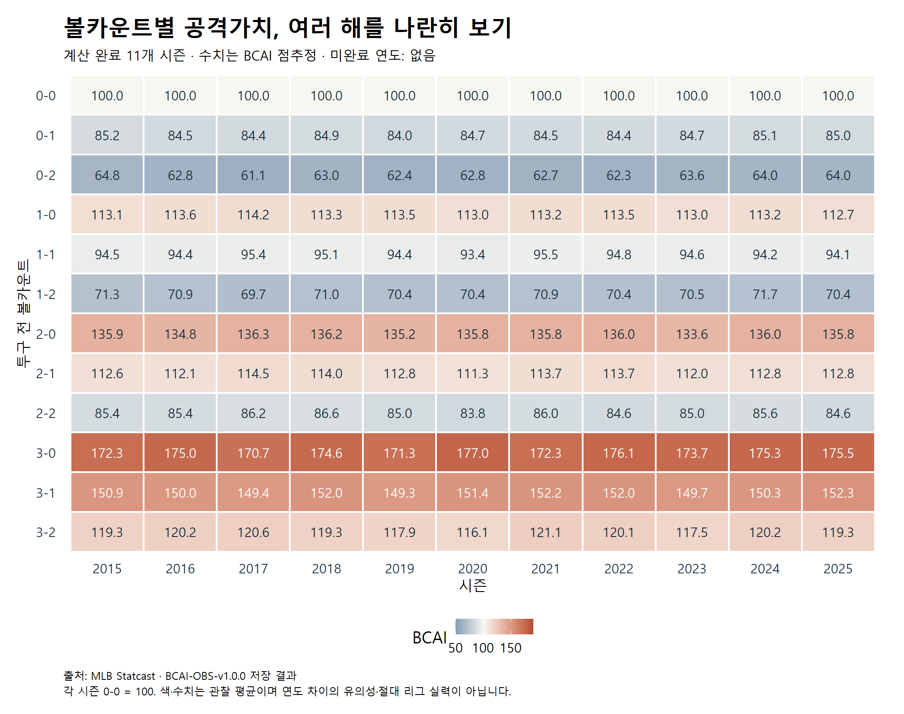
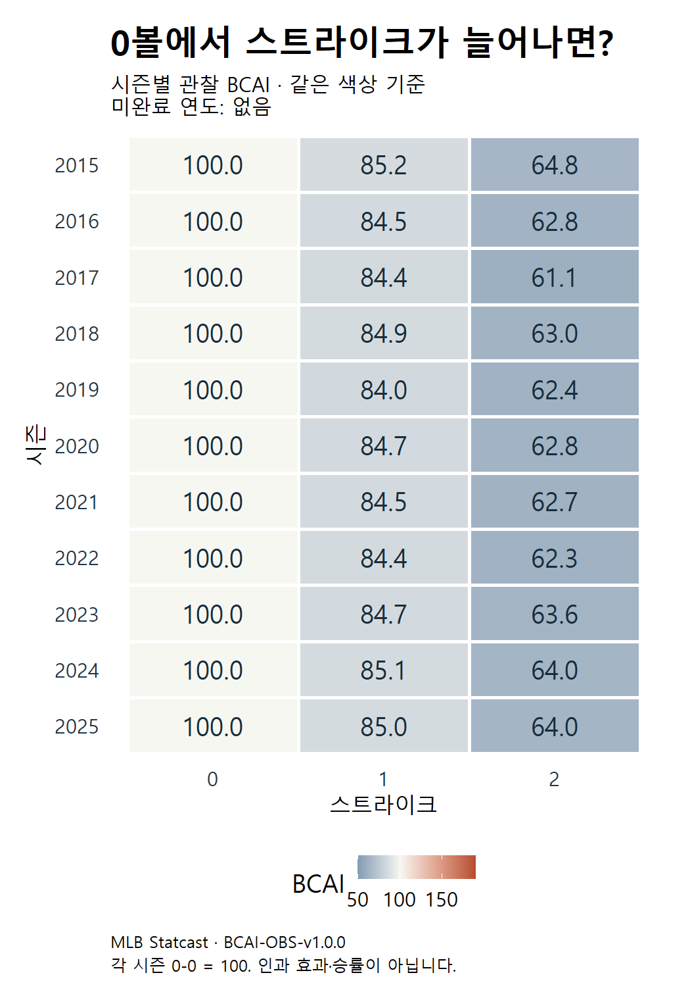
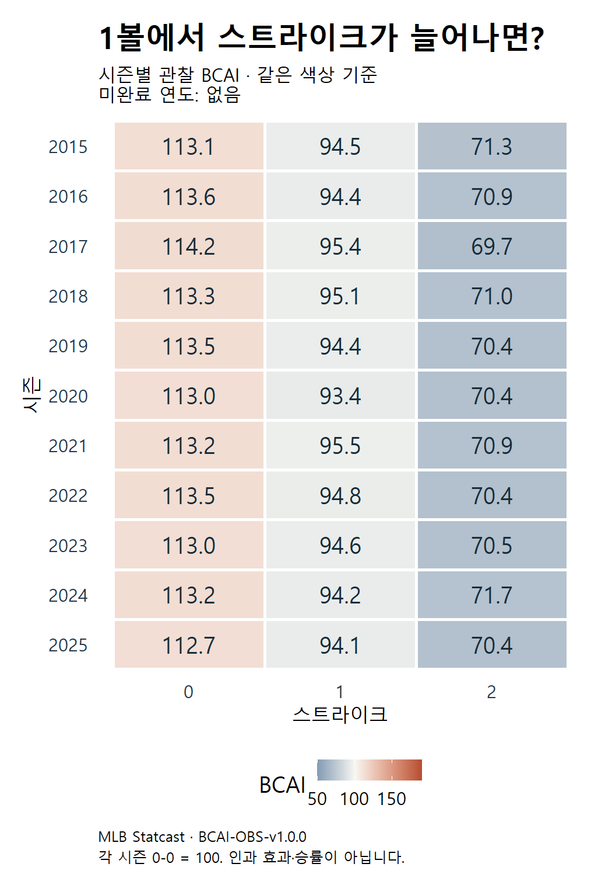
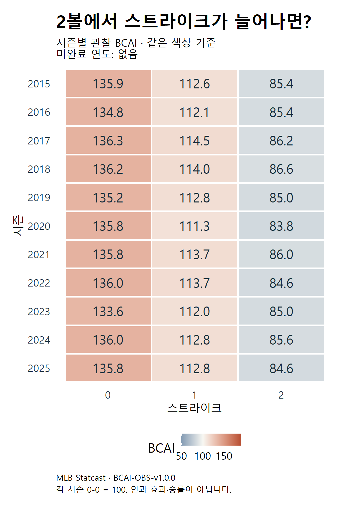
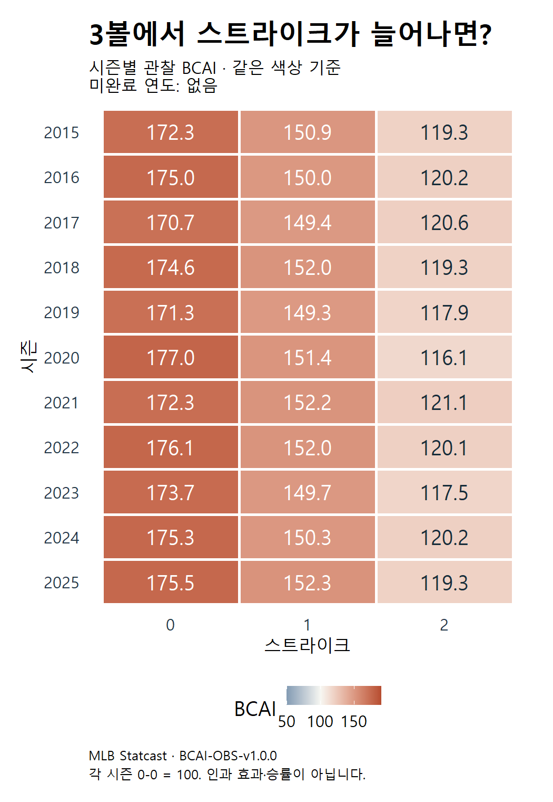

# BCAI 과거 연도 결과 모음

**2015~2025 목표 11개 시즌 중 11개 시즌의 R 계산이 완료됐다.** 이 화면은 완료된 저장 결과만 모으며, 계산 중·실패·미실행 연도의 수치를 채우지 않는다.

**2015~2025의 모든 목표 시즌 계산이 완료됐다.**

- 완료: 2015·2016·2017·2018·2019·2020·2021·2022·2023·2024·2025 (11개 시즌)
- 미완료: 없음 (0개 시즌; 계산 중·대기·실패 여부는 [진행 기록](progress.json) 확인)
- 2026은 이 전체 시즌 표에 포함하지 않는다. 별도 보조 비교의 실행 기록이 필요하다.
- 갱신: 2026-09-28 13:57:11 KST

## 여러 해의 모양은 어떤가?

색과 셀 안 숫자는 저장된 점추정값이다. 아래 비교만으로 변화가 확실하거나 차이가 없다고 판단하지 않는다.



## 표본과 결과의 출처

2024·2025는 기존 Python의 BCAI 점추정·분모·제외 내역을 R로 재현했다. 과거 연도의 실행 완료는 해당 연도의 자료·내부 확인을 뜻하며 Python 교차 재현이나 모델의 검증 범위 확장을 자동으로 뜻하지 않는다.

| 시즌 | 유효 타석 | 경기 | 관측 날짜 | 기간 구분 | 근거 |
| --- | ---: | ---: | --- | --- | --- |
| 2025 | 182,284 | 2,430 | 2025-03-18~2025-09-28 | 정규시즌 전체 일정 대조 | [결과](../runs/bcai_r_check__mlb_2024_2025__20260928__r02/artifacts/season_indices.csv) · [기록](../runs/bcai_r_check__mlb_2024_2025__20260928__r02/manifest.json) |
| 2024 | 181,840 | 2,429 | 2024-03-20~2024-09-30 | 정규시즌 전체 일정 대조 | [결과](../runs/bcai_r_check__mlb_2024_2025__20260928__r02/artifacts/season_indices.csv) · [기록](../runs/bcai_r_check__mlb_2024_2025__20260928__r02/manifest.json) |
| 2023 | 183,534 | 2,430 | 2023-03-30~2023-10-01 | 정규시즌 전체 일정 대조 | [결과](../runs/bcai_history__mlb_2023__20260928__r02/artifacts/season_indices.csv) · [기록](../runs/bcai_history__mlb_2023__20260928__r02/manifest.json) |
| 2022 | 181,502 | 2,430 | 2022-04-07~2022-10-05 | 정규시즌 전체 일정 대조 | [결과](../runs/bcai_history__mlb_2022__20260928__r01/artifacts/season_indices.csv) · [기록](../runs/bcai_history__mlb_2022__20260928__r01/manifest.json) |
| 2021 | 181,054 | 2,429 | 2021-04-01~2021-10-03 | 정규시즌 전체 일정 대조 | [결과](../runs/bcai_history__mlb_2021__20260928__r01/artifacts/season_indices.csv) · [기록](../runs/bcai_history__mlb_2021__20260928__r01/manifest.json) |
| 2020 | 66,269 | 898 | 2020-07-23~2020-09-27 | 단축 시즌 — 기간·경기 수가 다른 시즌과 다름 | [결과](../runs/bcai_history__mlb_2020__20260928__r02/artifacts/season_indices.csv) · [기록](../runs/bcai_history__mlb_2020__20260928__r02/manifest.json) |
| 2019 | 185,704 | 2,429 | 2019-03-20~2019-09-29 | 정규시즌 전체 일정 대조 | [결과](../runs/bcai_history__mlb_2019__20260928__r01/artifacts/season_indices.csv) · [기록](../runs/bcai_history__mlb_2019__20260928__r01/manifest.json) |
| 2018 | 184,170 | 2,431 | 2018-03-29~2018-10-01 | 정규시즌 전체 일정 대조 | [결과](../runs/bcai_history__mlb_2018__20260928__r01/artifacts/season_indices.csv) · [기록](../runs/bcai_history__mlb_2018__20260928__r01/manifest.json) |
| 2017 | 184,280 | 2,430 | 2017-04-02~2017-10-01 | 정규시즌 전체 일정 대조 | [결과](../runs/bcai_history__mlb_2017__20260928__r01/artifacts/season_indices.csv) · [기록](../runs/bcai_history__mlb_2017__20260928__r01/manifest.json) |
| 2016 | 183,610 | 2,428 | 2016-04-03~2016-10-02 | 정규시즌 전체 일정 대조 | [결과](../runs/bcai_history__mlb_2016__20260928__r01/artifacts/season_indices.csv) · [기록](../runs/bcai_history__mlb_2016__20260928__r01/manifest.json) |
| 2015 | 182,645 | 2,429 | 2015-04-05~2015-10-04 | 정규시즌 전체 일정 대조 | [결과](../runs/bcai_history__mlb_2015__20260928__r01/artifacts/season_indices.csv) · [기록](../runs/bcai_history__mlb_2015__20260928__r01/manifest.json) |

[합친 수치·구간 CSV](summary.csv) · [보고서 입력 해시와 확인 기록](report_validation.json) · [2024·2025 재현·연도 차이 해설](../runs/bcai_r_check__mlb_2024_2025__20260928__r02/report.md)

## 카운트별 점추정 표

| 카운트 | 2015 | 2016 | 2017 | 2018 | 2019 | 2020 | 2021 | 2022 | 2023 | 2024 | 2025 |
| --- | ---: | ---: | ---: | ---: | ---: | ---: | ---: | ---: | ---: | ---: | ---: |
| 0-0 | 100.00 | 100.00 | 100.00 | 100.00 | 100.00 | 100.00 | 100.00 | 100.00 | 100.00 | 100.00 | 100.00 |
| 0-1 | 85.23 | 84.52 | 84.38 | 84.89 | 84.05 | 84.67 | 84.50 | 84.42 | 84.73 | 85.11 | 85.02 |
| 0-2 | 64.78 | 62.82 | 61.10 | 63.01 | 62.40 | 62.84 | 62.72 | 62.27 | 63.65 | 63.97 | 64.01 |
| 1-0 | 113.11 | 113.62 | 114.19 | 113.29 | 113.52 | 113.02 | 113.23 | 113.52 | 113.00 | 113.19 | 112.72 |
| 1-1 | 94.51 | 94.37 | 95.38 | 95.11 | 94.44 | 93.40 | 95.53 | 94.83 | 94.58 | 94.19 | 94.13 |
| 1-2 | 71.25 | 70.90 | 69.67 | 70.97 | 70.44 | 70.41 | 70.88 | 70.42 | 70.48 | 71.66 | 70.40 |
| 2-0 | 135.88 | 134.79 | 136.26 | 136.16 | 135.18 | 135.80 | 135.83 | 135.97 | 133.61 | 135.95 | 135.76 |
| 2-1 | 112.58 | 112.07 | 114.47 | 113.98 | 112.77 | 111.29 | 113.65 | 113.73 | 112.03 | 112.80 | 112.79 |
| 2-2 | 85.41 | 85.38 | 86.20 | 86.59 | 85.03 | 83.82 | 86.00 | 84.56 | 85.04 | 85.64 | 84.57 |
| 3-0 | 172.28 | 174.96 | 170.75 | 174.61 | 171.34 | 176.95 | 172.31 | 176.09 | 173.66 | 175.34 | 175.47 |
| 3-1 | 150.86 | 150.05 | 149.36 | 151.99 | 149.29 | 151.37 | 152.22 | 151.96 | 149.68 | 150.27 | 152.34 |
| 3-2 | 119.33 | 120.15 | 120.61 | 119.35 | 117.89 | 116.10 | 121.08 | 120.08 | 117.47 | 120.18 | 119.28 |

## 모바일 블로그용 그림

연도 수가 늘어도 세 칸씩 읽도록 볼 수에 따라 나눴다. 네 그림은 같은 색상 범위를 쓴다.









## 해석할 때 남겨둘 선

- BCAI는 해당 카운트에 도달한 타석의 최종 가중 공격가치를 그 시즌 0-0 평균과 비교한 값이다. 120은 시작점 대비 20% 높은 관찰 평균이며, 승률·인과 효과·최적 행동의 점수가 아니다.
- 각 시즌을 서로 다른 기준 평균으로 정규화하므로 연도 간 절대 리그 실력이나 득점 환경의 우열을 읽을 수 없다. 이 표와 히트맵은 패턴을 탐색하기 위한 나란한 표시이며 연도 차이의 유의성 검정이 아니다.
- 시즌별 개별·근사 동시 구간은 summary.csv와 원 결과표에 보존했다. 동시 구간은 각 실행의 정의를 따르며, 전체 역사 연도와 모든 비교를 한꺼번에 보장하는 구간은 아니다. 따로 실행한 단일 연도의 같은 seed 재표본을 임의로 짝지어 빼지 않았다.
- 경기 단위 부트스트랩은 경기 안의 의존성을 반영하지만 경기 사이 동일 선수의 의존성과 외부 가중치 추정 오차까지 반영하지 않는다. 일정 경기 ID 일치는 경기 안의 투구·타석 완전성 보장이 아니다.
- 2020은 단축 시즌이며 실제 경기 수·관측 기간을 표에 별도 표시했다. 표본 크기가 다르므로 다른 시즌과 같은 정밀도로 간주하지 않는다.

## 파일 사용과 갱신 방법

report.html은 그림과 표를 함께 보는 화면, report.md는 편집 가능한 보고서다. summary.csv는 시즌·카운트별 점추정·구간·분모와 원 실행 경로를 담으며, report_validation.json은 입력 해시와 확인 범위를 기록한다. 블로그에는 전체 히트맵이나 모바일용 0·1·2·3볼 PNG를 사용하고 단위·출처·해석 주의를 함께 남긴다.

저장소 루트에서 아래 명령을 다시 실행하면 새로 완료된 연도를 읽고 이 허브와 그림만 갱신한다. 통계 재계산·다운로드·기존 실행 변경은 하지 않는다.

```powershell
./tools/run_r.ps1 -Script tools/render_bcai_history.R
```

연도별로 가장 최근 완료된 `bcai_history` 실행을 선택한다. 2024·2025의 기준 실행은 r02로 고정했다. 실패 기록은 포함하지 않고 보존한다. 원 결과 CSV·표본·검증 JSON의 해시와 12카운트·0-0 기준을 확인한 뒤 저장 결과만 표시한다. 기존 발행 원고·외부 게시물은 자동으로 변경하지 않는다.
