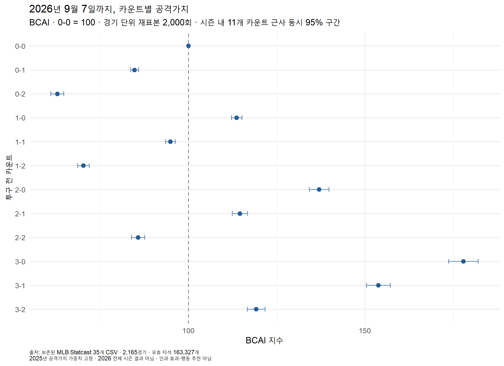
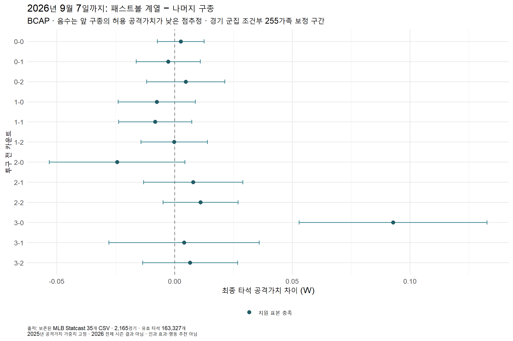
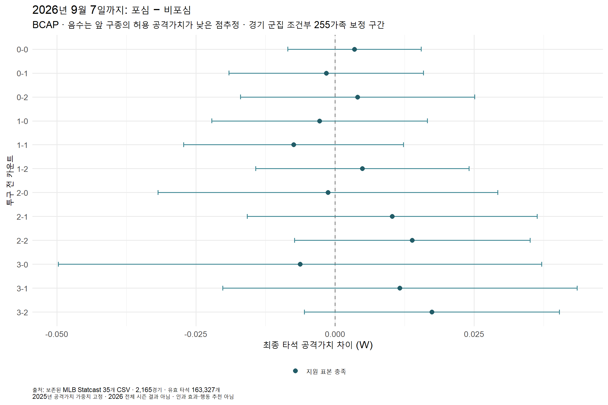

# 2026 보조 R 분석 — 9월 7일까지

**BCAI와 BCAP 구종 두 모듈의 R 계산 완료. 전체 시즌 결과가 아닌 보조 자료다.**

2026년 3월 25일~9월 7일의 보존된 원 CSV 35개를 사용했다. 신규 수집 없이 639,042개 투구 행, 2,165경기, 유효 타석 163,327개를 확인했다. 2026 고유 가중치를 새로 추정하지 않고 기존 계획의 2025 가중치(BB .691, HBP .722, 1B .882, 2B 1.252, 3B 1.584, HR 2.037)를 고정했다.

## 계산 범위

- BCAI-OBS: R 집계와 경기 단위 bootstrap 2,000회. 0-0=100이며 시즌 내 11개 카운트의 근사 동시 구간을 제공한다. 다른 시즌과 공식 차이 검정은 수행하지 않았다.
- BCAP-PITCH·PITCH-FF: 2026 안에서 경기 3분할 OOF 재적합. 기존 개발 규제값 고정, seed=20262954, 가족=255. R 분할은 원 NumPy 분할과 같다고 주장하지 않는다.
- BCAP S/B·SWING: WITHHELD_MEASUREMENT. 2026 위치·존 정의의 비교 가능성 문제를 해결하기 전까지 계산하지 않았다.

## 해석과 한계

카운트별 도달 타석과 구종별 공통 지원 표본이 다르므로 지수나 공격가치 차이를 인과 효과·실전 행동 추천·타석 전체 정책 개선량으로 읽지 않는다. BCAP 구간은 고정 OOF 점수의 경기 군집 조건부 구간이며 보조 모형 전체 학습 변동과 경기 간 선수 의존성을 포함하지 않는다. 과거에 이미 노출된 2026 자료의 재계산이며 새 미노출 외부 검증으로 부르지 않는다.

## 검산 기록

세 완료 실행의 결과·동결 코드·전처리 입력 해시와 원 35개 파일 보존을 확인했다. 새 완료경기 기준은 일정 기록 수를 2,192→2,166으로 줄이지만 고유 경기 집합은 2,165개로 정확히 같다. 기존 준비 결과의 표본에는 영향이 없다.

2026은 새 R 경기 분할로 적합했으며 원 Python 행별 점수 재현을 검사한 작업이 아니다. 동결 실행기의 checks.json에 남은 공통 scope 문구보다 실제 검사 목록과 본 보고서를 이번 검증 범위의 기준으로 사용한다. 원 점수 재현은 앞선 2024·2025 실행에서 별도로 확인했다.

알려진 카운트 예외 824212/43/3 행은 제외하지 않고 원래 Y와 함께 유지했다. 준비 사본의 known_count_exception 플래그가 이 2026 사례를 표시하지 않는 감사상 차이가 있으나 이 플래그는 모델 입력·제외 기준이 아니므로 계산값에는 영향을 주지 않는다. 후속 원자료 감사에서 별도 표를 참고한다.

- 상세 검산: [postflight.json](postflight.json)
- 측정 보류: [withheld_measurement.json](withheld_measurement.json)
- [BCAI 표](bcai_summary.csv) · [BCAP 표](bcap_summary.csv)

## 블로그용 그림

