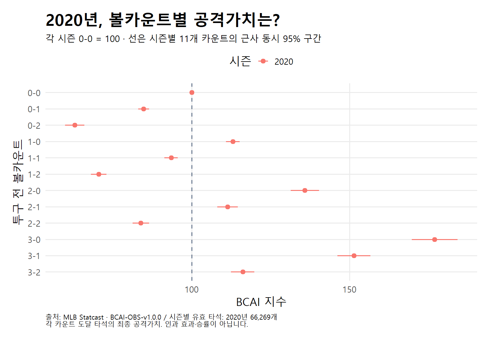

# 2020 BCAI R 계산 — 미실시 경기의 일정 분류 수정

**2020 단축 시즌의 R 계산을 완료했다.** 유효 표본은 **66,269타석·898경기**, 관측 기간은 **2020-07-23~2020-09-27**이다. 일정의 미실시 경기 두 건을 완료 경기로 잘못 포함하던 검사만 고쳤으며, BCAI 추정 공식·입력·가중치는 바꾸지 않았다. [실행 기록](manifest.json) · [검증 결과](artifacts/validation.json) · [시즌 결과 CSV](artifacts/season_indices.csv).

## r01은 왜 중단됐나?

[r01 실패 기록](../bcai_history__mlb_2020__20260928__r01/manifest.json)은 일정 900경기와 입력 898경기의 불일치를 기록한다. gamePk **631471·631472**는 같은 저장 일정 안에 `Postponed`(`codedGameState=D`, `statusCode=D9`)와 `Cancelled`(`C`, `C9`) 기록이 모두 있었다. 이들의 추상 상태도 `Final`이어서, 기존의 `Final`·취소 제외 조건만으로는 연기 기록이 남았다. 실제 완료 기록은 없었다.

완료 경기 판정을 **정규시즌 R + 추상 상태 Final + 코드 F + 상세 상태 Final/Completed Early**의 조합으로 한정했다. 실제로 진행한 뒤 조기 종료된 경기는 포함하고, 연기·취소·중단·알 수 없는 상태는 포함하지 않는다. 같은 경기가 일정에 반복될 수 있으므로 gamePk를 중복 제거한다. 원 일정·원본 투구·입력 CSV를 삭제하거나 고친 것은 아니다.

## 무엇을 확인했나?

- 실제 실행기의 완료 판정 함수를 추출해 정상 종료·조기 종료·Final로 표시된 연기/취소·중단·불일치·미지정 상태·포스트시즌 등 **9개 사례**를 확인했다.
- 저장된 2020~2025 일정의 모든 정규시즌 상태 조합을 검사했다. 2020만 **900→898경기**로 바뀌고 2021~2025는 각각 **2,429·2,430·2,430·2,429·2,430경기**로 유지됐다.
- 수정된 2020 완료 경기 ID 집합은 입력 CSV의 실제 898경기와 정확히 일치했다. [필터 확인 코드](check_schedule_filter.R) · [상태 조합·경기 수·해시](schedule_check.json).
- r02 설정은 r01에서 run ID만 바꿨다. 같은 입력 264,262행·전체 66,638타석에서 고의볼넷 202, 중단 96, 마지막 결과 결측 36, 타격방해 35타석을 제외했다. [표본](artifacts/cohorts.csv) · [제외 감사](artifacts/exclusion_audit.csv).

이번 실행은 시즌 내 경기 단위 **2,000회 부트스트랩**, seed `20260928`을 유지했다. 기존 실패 r01을 성공으로 덮어쓰지 않았으며, r02의 실행 시점 코드는 `artifacts/code/`에 보존돼 있다.

## 블로그에서 읽는 범위

이 지수는 카운트 도달 타석의 최종 가중 공격가치를 해당 시즌 0-0 평균과 비교한 관찰값이다. 인과 효과·승률·절대 리그 실력으로 해석하지 않는다. 2020은 단축 시즌이므로 다른 시즌보다 적은 경기·타석과 짧은 기간을 함께 표시한다. 경기 ID 일치는 경기 안의 모든 투구·타석이 완전하다는 보장이 아니다. 다른 연도와의 유의한 차이를 이번 단일연도 실행으로 검정하지 않았다.

[여러 연도 결과 허브](../../r_history_20260928/report.html)는 완료 결과를 모아 보여 준다. 이번 수정은 기존 발행 원고·외부 게시물에 자동 반영하지 않았다.
