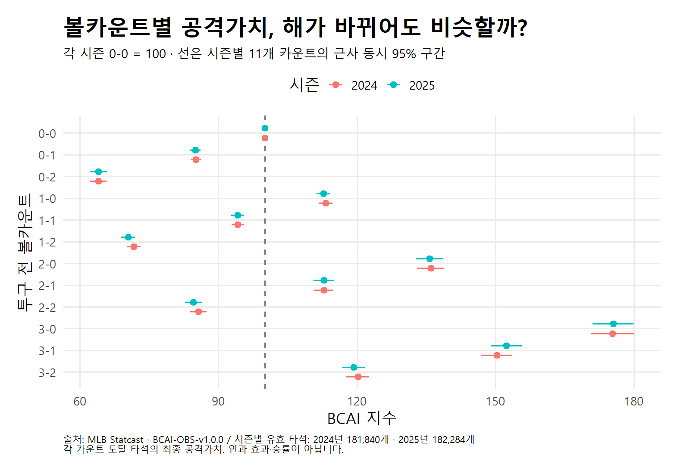
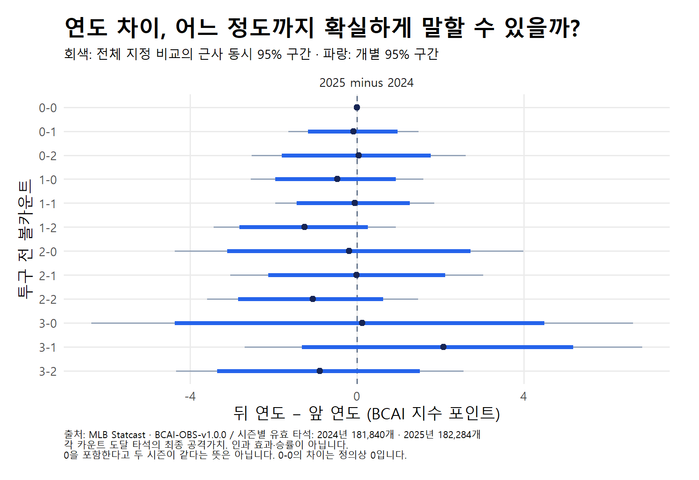

# 2024·2025 BCAI R 재계산과 연도 차이

**R 재계산은 기존 Python의 BCAI 점추정값·타석 분모·제외 내역을 재현했다.** 유효 표본은 **364,124타석·4,859경기**다. 두 시즌의 카운트별 지수 차이는 최대 **2.07포인트**였으며, 비기준 11카운트의 연도 차이에 대한 근사 동시 95% 구간은 모두 0을 포함했다. 이는 이번 방법으로 뚜렷한 연도 차이를 확인하지 못했다는 뜻이며, 두 시즌이 같거나 차이가 무시할 만큼 작다는 검증은 아니다.

실행: `bcai_r_check__mlb_2024_2025__20260928__r02` · 모델: `BCAI-OBS-v1.0.0` · 계산일: 2026-09-28 · [실행 기록](manifest.json) · [검증 결과](artifacts/validation.json).

## 무엇이 재현됐나?

통합 지수의 R−Python 최대 절대 오차는 **6.27×10⁻¹¹**, 시즌별 지수는 **7.17×10⁻¹¹**로, 사전 허용오차 `1e-9` 이내다. 12카운트 통합 분모, 24개 시즌별 카운트 분모, 전체·유효 타석 수와 제외 내역도 일치했다. 합산 지수는 0-2 **63.99**, 3-0 **175.40**다. [점추정 재현표](artifacts/point_reproduction.csv) · [통합 결과표](artifacts/combined_indices.csv).

| 시즌 | 유효 타석 | 경기 | 자료의 경기 날짜 |
| --- | ---: | ---: | --- |
| 2024 | 181,840 | 2,429 | 2024-03-20~2024-09-30 |
| 2025 | 182,284 | 2,430 | 2025-03-18~2025-09-28 |
| 합계 | 364,124 | 4,859 | 두 시즌 정규시즌 |

1,424,427개 입력 행에 366,231타석이 있었다. 제외는 고의볼넷 1,065, 중단 타석 635, 마지막 결과 결측 221, 타격방해 186타석으로 총 2,107타석이다. 카운트별 분모는 해당 카운트에 도달한 유효 타석이며, 파울로 같은 카운트가 반복돼도 한 타석을 한 번만 센다. 서로 다른 카운트에는 같은 타석이 포함될 수 있다. [시즌 표본표](artifacts/cohorts.csv) · [제외 감사표](artifacts/exclusion_audit.csv).

## 해가 바뀌어도 비슷한가?

**0-2에서 가장 낮고 3-0에서 가장 높은 큰 모양은 두 시즌에서 같았다.** 아래 지수는 각 시즌의 0-0을 각각 100으로 놓은 상대값이다. 연도 차이는 **2025−2024**, 단위는 BCAI 지수 포인트다.

| 카운트 | 2024 | 2025 | 연도 차이 | 차이의 근사 동시 95% 구간 |
| --- | ---: | ---: | ---: | --- |
| 0-0 | 100.00 | 100.00 | 0.00 | [0.00, 0.00] — 정의상 고정 |
| 0-1 | 85.11 | 85.02 | −0.09 | [−1.65, 1.47] |
| 0-2 | 63.97 | 64.01 | +0.04 | [−2.53, 2.61] |
| 1-0 | 113.19 | 112.72 | −0.48 | [−2.55, 1.59] |
| 1-1 | 94.19 | 94.13 | −0.06 | [−1.96, 1.85] |
| 1-2 | 71.66 | 70.40 | −1.26 | [−3.44, 0.93] |
| 2-0 | 135.95 | 135.76 | −0.19 | [−4.36, 3.99] |
| 2-1 | 112.80 | 112.79 | −0.01 | [−3.04, 3.02] |
| 2-2 | 85.64 | 84.57 | −1.06 | [−3.59, 1.47] |
| 3-0 | 175.34 | 175.47 | +0.12 | [−6.37, 6.62] |
| 3-1 | 150.27 | 152.34 | +2.07 | [−2.70, 6.84] |
| 3-2 | 120.18 | 119.28 | −0.89 | [−4.34, 2.55] |

가장 큰 점추정 차이는 3-1의 +2.0701포인트다. 그 차이의 구간은 −2.6958~6.8360포인트로 0의 양쪽에 걸친다. “2025년에 3-1의 가치가 확실히 커졌다”거나 “모든 카운트의 가치가 해마다 같다”고 쓰기에는 근거가 부족하다. 동등성을 판단할 허용 차이도 이번 분석에서는 미리 정하지 않았다. [시즌별 원 수치](artifacts/season_indices.csv) · [연도 차이 원 수치](artifacts/year_differences.csv).

두 PNG는 저장 결과를 소개하는 블로그용 그림이다. 기존 발행 원고를 바꾸거나 외부 게시한 것은 아니다.

## 무엇을 계산했고, 어디까지 믿을 수 있나?

BCAI는 **해당 카운트에 도달한 타석의 최종 가중 공격가치가 그 시즌 시작점 평균의 몇 배인가**를 나타낸다. 120은 시작점 대비 20% 높은 관찰 평균이지 승률 120%, 득점 20% 증가, 특정 행동의 효과가 아니다. 안타 종류·비고의 볼넷·몸에 맞는 공에 시즌별 가중치를 적용하고, 삼진·아웃·OTHER에는 0을 준다. 희생번트를 포함하므로 공식 wOBA와도 다르다. [모델 카드](../../../../../models/bcai/observed/v1.0.0/model_card.md) · [명세](../../../../../models/bcai/observed/v1.0.0/specification.yaml).

R은 기존 Python 캐시에서 **형식만 CSV로 옮긴 투구 행**을 받아 타석 구성·제외·가중치 적용·카운트 도달 집계·지수 계산을 별도로 수행했다. Python 결과표를 그대로 읽어 결과로 내놓은 것은 아니지만, 입력 캐시를 공유했으므로 원본 수집·전처리부터 완전히 독립적으로 재검증한 것도 아니다. [변환 이력](../../../data/processed/r_transport_20260928_r01/pitches.provenance.json).

불확실성은 시즌 안에서 경기 단위로 **2,000회 복원추출**해 구했다. 한 번의 추출을 모든 카운트에 공유하고 0-0 평균을 매번 다시 계산했다. 외부 가중치와 시즌 혼합비는 고정했다. 개별 구간은 2.5·97.5백분위, 동시 구간은 비기준 11카운트의 표준화 절대 편차 최댓값으로 구했다. 연도 차이도 이 다년 실행 안의 재표본으로 계산했으며, 차이의 동시 임계값은 2.7910이다. 이번 R 난수 방식·seed는 기존 Python과 달라 부트스트랩 구간의 숫자 일치까지 요구하지 않았다. [설정](config.json) · [R 환경](artifacts/sessionInfo.txt).

관측 경기 ID 집합은 저장된 정규시즌 일정과 일치했다. **이는 경기 안의 투구·타석 누락까지 없다는 보장은 아니다.** 도달 집단 선택 편향과 미측정 교란, 여러 경기에서 반복 등장하는 선수 간 의존성, 외부 가중치의 추정 오차도 남는다. 두 해의 지수는 각 시즌 평균으로 따로 정규화했으므로 절대 공격력의 연도 차이로 읽지 않는다. 이번 결과로 모델 상태를 승격하거나 다른 연도·KBO의 검증을 완료했다고 선언하지 않는다.

## 첫 실행은 왜 멈췄나?

[r01 실패 기록](../bcai_r_check__mlb_2024_2025__20260928__r01/manifest.json)은 보존했다. 점추정·카운트 분모 확인 뒤, 반복 PA×count 제거 행 수의 **감사 집계 범위**가 기존 Python과 달라 중단됐다. 첫 R 구현은 유효 타석 행만 셌지만 기존 감사값은 타석 제외 전 전체 입력을 기준으로 했다. 전체 입력 기준으로 고쳐 **98,606행**과 일치시킨 뒤 새 ID인 r02로 실행했다. r01에서는 부트스트랩을 완료하지 않았으며, 그 실패를 성공으로 덮어쓰지 않았다.

## 다른 연도로 이어갈 때

계산식은 연도를 고정하지 않은 [R 실행기와 설정 안내](../../../../../models/bcai/observed/v1.0.0/r/README.md)로 재사용한다. 새 연도마다 입력 출처·시즌별 가중치·정규시즌 일정·누락과 제외 내역을 확인하고 새 실행 ID에 저장한다. 개별 연도 실행에서 같은 seed를 쓴 결과를 임의로 짝지어 연도 차이 구간을 만들지 않고, 비교할 연도를 한 설정에 명시한 다년 실행으로 비교한다. 이 보고서는 2024·2025만 다루며 과거 확장의 성공 여부는 각 실행 기록을 따로 확인한다.
