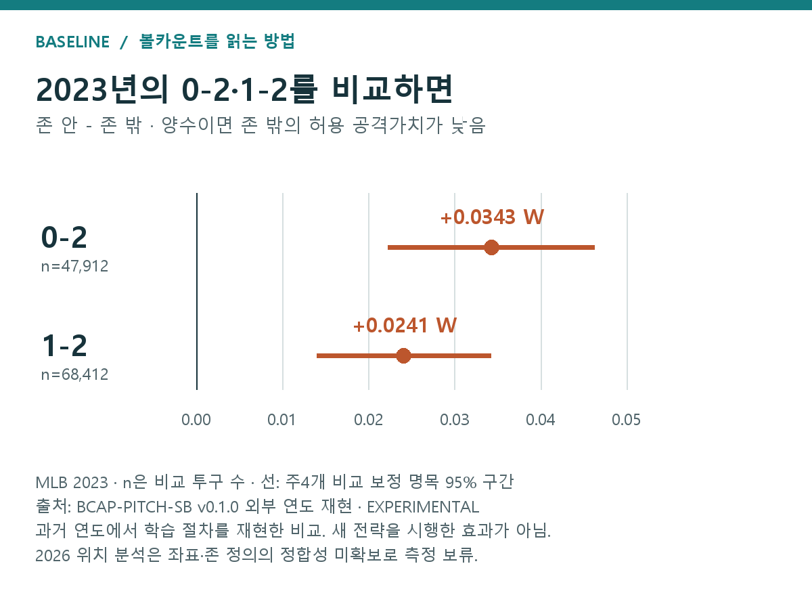

# 볼카운트 칼럼을 쓰면서 — 데이터와 모델을 고쳐 온 기록

*Baseline 볼카운트 연재 ⑤ · 2026년 9월 29일 · 작업 회고 20차*

이번 칼럼을 준비하며 했던 작업을 시간순으로 정리해 두려고 한다. 결과를 한 번 계산하고 글로 옮긴 것은 아니었다. 무엇을 한 번으로 셀지 정하고, 계산이 제대로 끝났는지 확인하고, 다른 연도의 자료를 붙여 보면서 설명과 분석의 범위를 여러 차례 고쳤다.

아래 날짜는 남아 있는 작업 기록을 기준으로 했다. 서로 겹쳐 진행한 일은 주요 수정과 확인이 이루어진 시점에 묶었다. 새롭게 분석한 글이 아니라, 무엇을 시도했고 무엇을 고쳤으며 끝내 어디까지밖에 말할 수 없었는지를 남기는 개인적인 정리다.

## 1. 9월 6–7일 — 질문보다 먼저 집계 기준을 정해야 했다

처음에는 카운트별로 다음 구종과 선택 비율, 볼·스트라이크 결과, 스윙 여부, 다음 공과 최종 타석 결과까지 함께 보고 싶었다. 같은 카운트라도 어떤 경로로 왔는지, 점수와 주자 상황이 다른지도 관심사였다. 그런데 이 질문들을 한꺼번에 다루기 전에, 우선 ‘카운트가 유리하다’는 말을 어떤 숫자로 표현할지부터 정해야 했다.

첫 기준 자료는 MLB 2024·2025였다. 처음부터 지금의 11시즌 결과가 있었던 것은 아니다. 먼저 두 시즌의 기록에서 타석의 시작과 끝을 연결하고, 카운트에 도달한 타석의 결과를 평균내는 BCAI를 정리했다.

**기존 BCAI 기준 표는 MLB 두 시즌, 4,859경기의 유효 완료 364,124타석으로 만들었다.** 원자료는 Statcast 기록이다. 한 타석의 시작부터 최종 결과까지 연결할 수 있는지를 먼저 확인했다.

| 원자료에 기록된 타석의 처리 | 타석 수 | 이유 |
| --- | ---: | --- |
| 검토 대상 | 366,231 | 확보한 원자료에 있는 타석 |
| 고의볼넷 제외 | 1,065 | 일반적인 투타 승부와 구별 |
| 불완전하게 끝난 기록 제외 | 635 | 타석의 최종 결과를 확정할 수 없음 |
| 최종 결과 결측 제외 | 221 | 안타·아웃 등을 정할 정보가 없음 |
| 타격방해 제외 | 186 | 일반적인 타석 결과와 구별 |
| 최종 분석 대상 | **364,124** | 2024년 181,840 + 2025년 182,284 |

*기존 2024·2025 BCAI의 표본 흐름이다. 11년 전체의 제외 합계가 아니다. 이 숫자를 BCAP의 모든 위치·구종 비교에 그대로 적용하지 않는다. 각 행동 비교에서는 필요한 변수와 양쪽 행동의 비교 가능성을 추가로 확인한다.*

가령 마지막 결과가 비어 있는 타석을 아웃으로 채우면 표를 완성하기는 쉽다. 하지만 없던 실패를 만든 셈이 된다. 이번에는 그렇게 채우지 않고 제외했다. 따라서 ‘MLB에서 실제로 발생한 모든 타석을 하나도 빠짐없이 복원했다’는 의미의 총계는 아니다.

이 과정에서 ‘자료에 숫자가 있다’와 ‘같은 기준으로 셀 수 있다’가 다르다는 점을 계속 확인해야 했다. 특히 타석을 세는 표와 공을 세는 표를 한 문장에 넣으면, 서로 다른 비율을 같은 기준처럼 읽기 쉬웠다.

**같은 카운트에서 파울을 세 번 쳐도 BCAI에서는 그 타석을 한 번만 센다. 스윙률에서는 실제 던진 공들을 각각 센다.**

예를 들어 1-2에서 파울 두 개를 친 뒤 볼을 골라 2-2로 갔다고 하자. 이 타석은 BCAI의 1-2 집단에 한 번 들어간다. 우리가 묻는 것은 ‘1-2를 거친 타석이 어떻게 끝났나’이기 때문이다. 반면 1-2의 스윙률을 구할 때는 파울 두 공과 볼 한 공이 각각 판단 기회다.

| 알고 싶은 것 | 세는 단위 | 반복 파울의 처리 |
| --- | --- | --- |
| 해당 카운트를 거친 타석의 최종 가치 | 타석 × 카운트 | 같은 타석·카운트는 한 번 |
| 해당 카운트에서 얼마나 자주 휘둘렀나 | 실제 투구 | 각각의 공을 셈 |
| BCAP의 행동별 결과는 어땠나 | 비교 기준을 통과한 투구 | 같은 타석의 여러 투구가 포함될 수 있음 |

그래서 기존 2024·2025의 3-0에서 최종적으로 볼넷이 된 **60.99%**와 그 카운트의 스윙률 **9.07%**는 서로 빼거나 더할 비율이 아니다. 앞은 유효 도달 타석, 뒤는 구종이 확인된 실제 투구를 분모로 삼는다. 자동 볼·스트라이크 등을 제외하는 투구 집계 기준도 별도로 적용했다.

> **해석 메모 | 많은 공이 모두 별개의 실험은 아니다**
>
> 한 타석의 여러 공은 같은 최종 결과를 공유한다. 같은 경기의 기록도 서로 관련될 수 있다. 투구 수가 많다는 이유만으로 모두 독립된 관찰이라고 계산하지 않았으며, 불확실성을 구할 때 경기 단위를 고려했다.

결과를 점수로 바꾼 뒤에도 단위 설명이 필요했다. 단순히 ‘공격가치’라고 쓰면 실제 득점이나 확률로 읽힐 수 있었기 때문이다.

**W는 타석의 최종 결과에 점수를 붙여 서로 비교하는 척도다.** 2024년에는 비고의 볼넷 0.689, 단타 0.882, 홈런 2.050처럼 해당 시즌의 wOBA 가중치를 사용했다. 이 점수를 평균 내면 안타 수만 세는 것보다 볼넷과 장타를 함께 볼 수 있다.

다만 분모에는 희생번트도 포함한 유효 완료 타석을 사용했다. 그래서 이번 평균 W를 공식 wOBA와 같은 값이라고 부르지 않는다. 실책 출루나 아웃 없는 야수선택은 별도 분류이며 이 척도에서는 0을 주지만, 그것을 기록상 아웃으로 바꾼 것도 아니다.

> **해석 메모 | 0점은 실제 영향이 없었다는 뜻이 아니다**
>
> 이 점수표에 별도 공격 크레딧을 주지 않았다는 뜻이다. 실책으로 주자가 들어온 경기 장면까지 ‘아무 득점 영향이 없었다’고 평가한 것이 아니다. 주자 진루와 병살의 상황별 실제 득점 변화를 모두 반영하는 척도도 아니다.

**BCAI는 시작 평균을 100으로 바꾼 지수이고, BCAP의 차이는 원래 W 단위다.** BCAI 120은 시작 평균보다 가중 공격가치가 20% 높았다는 뜻이다. BCAP에서 0.02 W 차이가 났다고 BCAI 2포인트 차이로 읽으면 안 된다.

이후 11시즌 비교에서는 연도별 지수·범위를 함께 확인했고, 본문의 표는 연도별 지수의 평균을 정수로 표시했다. 기존 두 시즌의 BCAI는 시즌별 시작 평균과 비교한 비율을 먼저 구한 뒤, 고정된 시즌 비중으로 합쳤다. 어떤 카운트에 특정 시즌의 기록이 더 많다는 이유만으로 비교가 흔들리는 일을 줄이기 위해서다. 정확한 공식과 전체 결과는 [BCAI 설명 글](02_bcai.md)에 있다.

## 2. 9월 8–9일 — Ridge가 멈췄다고 계산이 끝난 것은 아니었다

카운트별 평균을 만든 다음에는 선수와 시작 상황이 섞여 있다는 문제가 남았다. 이를 고려하기 위해 Ridge 보정을 붙였지만, 초기 계산은 반복 횟수 한도에서 멈췄다. 출력값이 생겼다는 것만으로 안정된 답을 얻었다고 볼 수 없었다.

**아래는 기존 개발·외부 평가 기록이다. 역사 11시즌 확장은 관찰 BCAI이며 Ridge의 11시즌 확장을 새로 확인한 것은 아니다.**

**후속 Ridge의 207개 적합은 모두 수렴 기준을 충족했다. 그래도 타석별 예측 오차의 개선은 작아 BCAI-OBS를 주 결과로 유지했다.**

초기 버전에서는 15개 적합 모두 반복 계산 150회 한도에 도달했다. 정해 둔 안정성 기준을 만족한 상태에서 멈춘 것이 아니었다. 선수와 구장 효과를 시즌마다 완전히 따로 두던 구조를 수정하고, 학습 자료 안에서 기준값과 보정 강도를 정하도록 절차를 보완했다. 계산 방식도 손보고, 후속 버전에서는 계산을 더 진행해도 예측이 사실상 달라지지 않는지 확인했다. 별도의 계산 방법으로 얻은 해와도 대조했다.

하지만 잘 멈추는 계산과 잘 맞히는 모형은 다르다. 모형의 타석별 예측 오차를 단순한 상수 예측과 비교한 개선 폭은 다음과 같았다.

| 평가 자료 | 예측 오차 감소율 |
| --- | ---: |
| 2024·2025 개발 자료의 교차검증 | 약 0.428% |
| 2023년 자료 | 약 0.179% |
| 2026년 9월 7일까지 | 약 0.205% |

*BCAI-Ridge v0.2.0 검증 보고서의 MSE 비교. MSE는 예측값과 실제 값의 차이를 제곱해 평균한 오차다. 각 평가의 정해진 상수 기준 대비 감소율이며 정확도·승률이 아니다.*

보정 전후 카운트 지수의 최대 이동도 약 1.61포인트였다. 2023·2026 평가에서도 0-2 최저·3-0 최고라는 큰 모습은 유지됐다. 다만 2026년은 9월 7일까지의 자료에 2025년 가중치를 고정해 적용했다. 계산 수정은 필요했지만, 그것만으로 훨씬 더 좋은 야구 설명을 얻었다고 말할 근거는 부족했다. 이 때문에 Ridge는 원래 결과가 보정 뒤 얼마나 달라지는지 보는 보조 자료로 남겼다.

> **해석 메모 | ‘수정 전후’ 비교의 범위**
>
> 후속 버전은 계산 방법뿐 아니라 변수와 평가 절차도 바뀌었다. 개선분 전체를 어느 한 수정의 효과로 나누어 설명할 수는 없다. 초기 실행은 지우지 않고 별도로 보존했다.

이 시기의 외부 평가 준비에서는 2026년 9월 7일의 11경기가 처음 자료에서 빠져 있는 것도 확인했다. 누락분을 보충한 뒤 고정한 모형으로 평가했고, 실패한 실행과 완료된 실행은 따로 남겼다. 2026년 결과는 9월 7일까지의 부분 시즌이며, 2025년 가중치를 고정해 사용했다는 조건도 함께 적었다.

계산이 안정됐다는 것, 자료를 보충했다는 것, 예측력이 높아졌다는 것은 각각 다른 확인이었다. 이 구분 때문에 Ridge를 주 지수로 올리지 않고 보조 진단으로 남겼다.

## 3. 9월 9–12일 — 행동을 비교하려니 이름과 분류부터 다시 봐야 했다

BCAI로 카운트의 상태를 본 뒤에는 같은 카운트에서 어떤 공과 행동이 다른 결과로 이어졌는지를 비교했다. BCAP의 초기 구현을 거쳐 위치·스윙·구종 비교를 정리하는 동안, 계산값뿐 아니라 비교의 이름이 중요해졌다. ‘패스트볼’, ‘포심’, ‘가운데’, ‘볼’이 서로 다른 뜻으로 읽힐 수 있었기 때문이다.

**분모와 이름을 정리하는 작업이 결과 해석을 바꿨다.** 타석과 투구를 구별하고, 반복 카운트의 중복을 정리했으며, 구종 비교도 두 종류로 나눴다.

| 처음 혼동하기 쉬웠던 것 | 최종 처리 | 독자가 알아둘 차이 |
| --- | --- | --- |
| 도달 타석 비율과 투구별 비율 | 서로 다른 분모로 표시 | 볼넷 비중과 스윙률을 직접 합치지 않음 |
| 패스트볼 계열과 포심 | 별도의 두 구종 비교 | 싱커·커터는 앞에서는 패스트볼, 뒤에서는 비포심 |
| ‘가운데’ 구역 | ‘존 안 전체’로 표현 | 한가운데 실투만 모은 결과가 아님 |
| B라는 표시 | 실제 공 중심이 존 밖인 경우 | 심판의 볼 판정이나 투수의 의도가 아님 |
| 2026년 평가 자료의 누락 | 누락 11경기를 보충한 뒤 평가 | 보충 전 자료로 최종 평가를 확정하지 않음 |

기존 개발·2023·2026 외부 확인에서 구종은 분류별 표본뿐 아니라 두 분류가 함께 비교 가능한 공통 표본에서도 살폈다. 분류를 바꾸면서 비교 대상까지 바뀌면 무엇 때문에 결과가 달라졌는지 알기 어려워서다. 96개 보고 비교에는 이렇게 겹치는 표본과 분류가 들어 있다. 독립된 실험 96개를 한 것은 아니다. 이번 역사 R 묶음은 분류별 자체 지원 표본이며 그 공통 표본 설계를 모든 해에 복원하지 않았다.

위 표의 2026년 누락 보충은 앞 절의 평가 준비에서 처리한 일이다. 분류 문제와 함께 작업 중 고친 항목으로 남겨 두었다. 이후 11시즌 확장에서 공통 표본 설계를 모든 해에 복원하지 않았다는 점도 당시 비교와 현재 결과를 구분하기 위한 기록이다.

**‘불명확’은 차이를 분명히 가리지 못했다는 뜻이고, ‘자료 부족’은 비교를 지탱할 기록이 부족하다는 뜻이다.** 둘 다 ‘차이가 없다’로 바꾸지 않았다.

예를 들어 대부분의 타자가 지켜본 상황에서 드물게 휘두른 몇 타석만 남았다면, 양쪽을 비교하는 일이 어려워진다. 전체 기록이 많아도 그 조건 안에서 양쪽 행동이 충분히 관찰됐는지가 중요하다. BCAP는 이런 비교 가능성을 확인하는 기준을 두었다. 원리는 [BCAP 설명 글](03_bcap.md)에 예시와 함께 정리했다.

2023년 존 안 3-0·3-1은 스윙 쪽 점추정이었지만 구간이 0을 포함했다. 존 밖 3-0의 네 구역은 비교 자료가 부족했다. 그래서 앞은 회색, 뒤는 빈칸으로 구분했다.

자료가 많다는 이유만으로 세부 비교도 모두 가능할 것이라고 취급할 수는 없었다. 이때부터 불명확한 차이와 비교 자료가 없는 경우를 다른 표시로 남겼다. 빈칸을 보기 좋게 채우는 것보다 판단을 보류한 이유를 드러내는 편이 분석에 맞았다.

## 4. 9월 14일 — 다른 해를 확인하면서 비교하지 않기로 한 자료도 생겼다

같은 결과가 다른 해에도 남는지 확인했지만, 여기서도 ‘외부 검증’이라는 말 하나로 묶을 수 없는 작업들이 있었다. 이미 만든 모형을 그대로 적용한 경우와 같은 절차로 그해 모형을 다시 만든 경우는 다른 일이었다.

**BCAI-Ridge의 외부 예측 평가와 BCAP의 다른 연도 패턴 확인은 구별해야 한다.** 같은 ‘2023년 확인’이라고 불러도 시행한 일이 다르다.

| 분석 | 2023년에 한 일 | 적절한 해석 |
| --- | --- | --- |
| BCAI-Ridge | 개발 자료에서 정한 최종 모형으로 예측 | 고정 모형의 외부 자료 예측 평가 |
| BCAP | 개발에서 정한 절차를 유지하고 2023년 안에서 보조 모형을 다시 학습 | 같은 분석 절차로 다른 연도의 패턴 확인 |

BCAP의 경우 경기 단위로 자료를 나누어, 학습에 쓰지 않은 부분에서 비교 점수를 계산했다. 그러나 2023년 자료는 이전 BCAI·BCAP 초기 분석에서 이미 살펴본 적이 있었다. 따라서 ‘전혀 보지 않은 미래 자료에서 최종 모형을 시험했다’고 표현하지 않는다.

그 범위 안에서 0-2의 존 안−존 밖 차이는 2023년 **+0.034266 W**, 1-2는 **+0.024117 W**였다. 양수는 존 밖의 허용 W가 더 낮았다는 뜻이다. 보정 구간도 각각 [0.022304, 0.046228], [0.014006, 0.034228]로 같은 방향이었다. 이런 확인은 한 시기의 우연한 모습일 가능성을 살피는 데 보탬이 되지만, 투구 지시의 실험을 대신하지는 않는다.

*그림 1. MLB 2023의 과거 연도 재현. 0-2는 47,912투구, 1-2는 68,412투구가 비교에 포함됐다. 차이는 각각 +0.034266 W, +0.024117 W. 주요 4개 비교를 보정한 구간은 각각 [+0.022304, +0.046228], [+0.014006, +0.034228] W다. 출처: 기존 BCAP 외부 연도 결과. 개발 그림과 다중비교 보정 범위가 다르다.*

2026년 자료는 더 조심해서 다뤄야 했다. 표본의 기간만 다른 것이 아니라 위치를 측정하는 기준도 달라져 있었기 때문이다.

**2026년의 위치 비교는 앞선 연도와 같은 자로 잰다는 근거를 확보하지 못해 보류했다.** 새로운 외부 행동별 결과를 계산·열람하기 전에 내린 판단이다.

기존에 확인한 공식 필드 설명에서는 공의 위치 좌표가 2025년까지 홈플레이트 앞면, 2026년부터 중간면 기준으로 구분돼 있었다. 존의 위아래 경계 정의도 달라졌다. ‘어디에서 잰 위치인가’와 ‘어디까지를 존이라고 부르는가’가 함께 달라진 셈이다.

존 경계 근처를 지나는 공이라면 이 차이가 분류에 영향을 줄 수 있다. 단순히 좌표의 단위를 맞추거나 높이를 비율로 바꾸는 것만으로 문제가 해결됐다고 볼 수 없었다. 검증된 대응 방법을 확보하지 못한 상태에서 앞선 해와 곧바로 비교하지 않았다.

| 2026년 분석 | 처리 | 이유 |
| --- | --- | --- |
| 투수의 존 안·밖 비교 | 보류 | 행동 자체가 위치와 존 경계에 의존 |
| 위치별 스윙·테이크 비교 | 보류 | 입력과 보고 구역 모두 위치 정의의 영향 |
| 두 구종 비교 | 진행 | 해당 모형은 위치 좌표와 존 파생변수를 사용하지 않음 |

*2026-09-14 측정 검토에 기록된 판단이다. 2026 자료는 9월 7일까지이며, 전체 시즌 결과가 아니다. 당시 확인한 문서와 검토 경위는 내부 작업 기록에 보존했다.*

> **해석 메모 | 보류와 재현 실패는 다르다**
>
> 2026년에 반대 결과가 나왔다는 뜻이 아니다. 같은 대상을 비교할 수 있는지를 먼저 해결해야 한다는 뜻이다. 구종 비교를 진행한 것도 구종 측정의 모든 연도 차이를 완전히 검증했다는 의미는 아니다.

## 5. 9월 15–18일 — 문헌을 읽고도 바로 채울 수 없는 설명이 남았다

이 시기에는 볼카운트 문헌을 넓게 찾아 읽고, 실제 원문을 확인한 자료와 확인하지 못한 자료를 구분했다. 초록만 확인한 연구를 충분히 읽은 근거처럼 쓰지 않았고, 원문을 읽은 경우에도 외부 연구의 결과를 자체 모형의 검증 결과와 섞지 않았다. 참고문헌을 늘리는 일과 지금의 주장을 뒷받침하는 일은 같지 않았다.

상태 평균 차이와 사건별 기여도 분해도 후속으로 살폈다. 계산을 하나 더 만들었다고 처음의 질문이 곧바로 해결되지는 않았다.

**0-2와 1-2의 평균 차이를 곧바로 ‘0-2에서 볼 하나를 던진 비용’으로 읽을 수는 없다.** 1-2에 도달한 타석 중에는 0-2를 거치지 않은 타석도 있기 때문이다.

2024년 평균 W 간격은 0-2와 1-2 사이에서 약 0.0238, 2-2와 3-2 사이에서 약 0.1069였다. 뒤쪽 간격이 더 컸다는 관찰은 가능하다. 그러나 서로 다른 도달 집단을 비교한 것이므로 같은 타석의 그 공만 볼로 바꾼 결과는 아니다. 이 차이의 계산 방법과 해석 범위는 [BCAI 해설](02_bcai.md)의 STATE-DELTA 절에 정리했다.

**헛스윙·약한 타구·다음 카운트가 각각 얼마나 기여했는지는 아직 실제 MLB 수치로 분해하지 못했다.**

존 밖 투구의 허용 W가 낮은 이유로 여러 경로를 생각할 수 있다. 타자가 따라 나와 헛스윙했을 수도 있고, 맞혔지만 좋지 않은 타구가 됐을 수도 있다. 지켜본 뒤 이어진 승부가 중요했을 수도 있다. 현재 결과만으로 어느 경로가 몇 퍼센트를 설명한다고 말할 수는 없다.

사건별 확률과 이후 가치를 합하는 계산 구조는 만들었다. 다만 모의 자료로 구조를 확인한 단계다. 계산식이 합을 제대로 내는지 확인한 것과 실제 야구에서 그 재료를 추정한 것은 구분해야 한다.

**현재의 평균 차이를 그대로 다음 경기의 배합 비율로 바꿀 수는 없다.** 0-2마다 존 밖만 던진다는 규칙을 타자가 알아채면, 지금보다 덜 따라 나올 수 있다.

이때 이득이 얼마나 줄어드는지 계산하려면 같은 선수·위치·상황에서 스윙 확률과 각 선택 이후의 가치를 함께 알아야 한다. 별도의 표에서 얻은 평균들을 임의로 곱해 답을 만들지 않았다. 상대 적응, 최적 혼합비율, 타석 전체의 최적 정책은 미산출 상태다. 관련 선행 연구의 접근은 [문헌 해설 9–11](04_references_ko.md#ref-09)에서 따로 읽을 수 있다.

9월 18일에는 후속 계산의 저장값과 산술을 확인했다. 그러나 합계와 수식이 맞는다는 확인을 실제 MLB의 원인별 기여도나 전략 효과를 얻었다는 말로 바꾸지는 않았다. 이 구분은 이후 원고에서도 계속 남겼다.

## 6. 9월 26–27일 — 계산한 순서와 독자가 이해하는 순서가 달랐다

원고를 다듬으면서는 설명 자체도 수정 대상이 됐다. 모델을 만들며 확인한 내용을 순서대로 나열하면 독자는 정작 결과와 단위, 비교 대상을 놓칠 수 있었다. 본문과 모델 설명, 참고문헌 해설, 검증·시행착오의 역할을 나누고 필수 단위와 해석 조건은 결과 곁에 남겼다.

본문은 야구 장면과 실제 결과를 중심으로 읽게 하고, 계산은 모델 해설로 옮겼다. 문헌은 이름만 붙이는 대신 무엇을 비교하고 어떤 결과를 얻었는지 풀어 썼다. 옮긴 설명이 사라지지 않도록 기존 원고와 수정 기록도 보존했다. 이 단계의 수정은 새로운 분석 결과를 만든 작업이 아니라, 이미 계산한 내용을 독자가 이해할 수 있게 정리하는 작업이었다.

## 7. 9월 28일 — R로 계산을 확인하고 열한 시즌으로 넓혔다

이날은 도구를 바꾸는 일과 자료의 기간을 늘리는 일을 구분했다. 먼저 2024·2025 계산을 R로 재현해 기존 값과 대조하고, 그다음 2023년에서 2015년까지 연도별로 확장했다. 새 언어에서 코드가 실행된다는 사실만으로 기존 계산을 재현했다고 말하지 않았다.

**기준 두 시즌의 R 재현과 추가 연도의 별도 적합을 나눠 확인했다.** BCAI는 기존 점추정·분모·제외를 재현했고, BCAP는 기존 분할·보정 경기·규제값을 사용한 R 재적합과 행별 점수·지원 마스크를 대조했다. 추가 연도는 각 해 자체 자료와 R 경기 분할로 별도 적합했다. 언어 전환의 수치 대조가 기간 비교의 모든 조건을 같게 만든 것은 아니다.

예를 들어 기존 Python 2023 위치 0-2는 +0.034266 W·47,912지원 투구, 새 R 결과는 +0.035043 W·47,932투구다. 같은 방향이지만 같은 지원 행·점수의 복제는 아니다. 기존 핵심 4개 비교 보정과 새 연도 상한 255개 보정도 다르다.

**전체 2015–2025는 1,896,892 유효 완료 타석·25,193경기다.** 기존 2024·2025의 364,124타석·4,859경기에 추가 2015–2023의 1,532,768타석·20,334경기를 연결했다. 카운트별 도달 타석을 더한 합계가 아니라 시작 타석 기준이다.

BCAP는 위치·구종·스윙에 필요한 정보와 행동별 지원 조건을 추가로 적용하므로 이 분모와 다르다. 모든 비교에 ‘190만 타석’이라는 같은 표본 크기를 붙이지 않는다.

**주요 방향은 남지만, 제외만으로 비교 문제가 해결되지는 않는다.** 2020은 898경기·66,269 유효 타석의 단축 시즌이다. 2015·2016 구속은 보정 PITCHf/x 기반으로 2017 이후 Statcast와 직접 동등성이 확인되지 않았다. 이전 구속 변수가 네 BCAP 모듈에 쓰여 모두 관련되는 제한이다.

추가 기간에서 2020을 빼면 FB/NFB 3-0은 8/8년 지원·양수 구간이다. 2017–2023으로 한정하면 6/7년 지원·지원된 6년 양수 구간이다. 포심/비포심 3-2는 2017–2023에서 7/7년 양수 점추정·3/7년 양수 구간이었다. 기간이 바뀌면 분모도 바뀌므로 원 결과의 ‘수정된 정답’이라고 부르지 않는다. 범위별 민감도와 실제 가중치

시즌별 W 가중치·표본 구성·지원 선택, 공유 적합과 연도별 적합의 차이는 남는다. 단일 공통 가중치의 재평가, 모든 해의 반복 분할·전체 재학습, 역사 Ridge 확장은 수행하지 않았다.

기간이 넓어지면서 불확실성 구간도 같은 방식으로 읽고 있는지 다시 확인했다. 그림의 선이 짧아졌다는 이유만으로 더 좋은 검증이라고 부를 수는 없었다.

**역사 BCAP 구간은 연도별 비교 가족 상한 255를 적용한 조건부 구간이다.** 11년의 모든 비교를 동시에 보장하는 구간이 아니다. 2024·2025 공유 적합의 PITCH/SB/SWING은 기존 219, FF는 255 가족을 사용했다. 연도별 구간이 겹치는지 또는 유의한 해가 몇 개인지로 연도 차이를 검정하지 않는다. 구간 공식과 적용 가족. 아래는 기존 개발·외부 확인에서 사용했던 구간의 범위다.

**구간은 점 하나보다 많은 정보를 주지만, 분석의 모든 불확실성을 한꺼번에 담지는 않는다.**

BCAI-OBS에서는 경기를 단위로 다시 뽑는 계산을 2,000회 수행하고, 기준 0-0을 제외한 11카운트의 동시 95% 구간을 구했다. 같은 자료를 조금 다르게 구성했을 때 지수가 얼마나 흔들리는지 살피는 방식이다. 이 구간을 Ridge 결과에 그대로 붙이지 않았다.

BCAP는 경기 안의 기록이 관련될 수 있다는 점과 여러 비교를 함께 보고 있다는 점을 고려한 구간을 사용했다. 다만 이미 얻은 비교 점수를 바탕으로 한 구간이라, 보조 모형을 다시 학습할 때 생기는 전체 변동까지 모두 포함하지는 않는다. 선수 단위의 모든 상관까지 해결한 것도 아니다.

> **해석 메모 | 두 그림의 선 길이를 겨루지 않는다**
>
> 개발 위치 그림은 219개 비교 보정, 2023년 핵심 위치 그림은 사전에 둔 4개 주요 비교 보정을 사용했다. 다른 보조 결과에는 236개 비교 보정이 쓰였다. 비교 묶음이 다르므로 선이 짧다는 이유만으로 어느 해가 더 정확한 모형이라고 결론 내리지 않는다.

**BCAI 132행과 BCAP 2,552집단 전체를 먼저 살핀 뒤 사례를 골랐다.** 53개 완료 실행과 입력 장부 172개 파일을 연결하고 지원 기준·차이·구간 공식·가중치·미지원 값 보류를 검산했다. 수치 검사 13항목과 화면 검사는 저장 출력의 산술·출처·표시 확인이다. 원자료 전체의 새 재적합이나 인과 타당성 검증은 아니다.

FanGraphs 과거 시즌 상수는 기존 출처 기록의 검색 색인 확인과 직접 접근 실패를 구분해 유지했다. 이 회고를 쓰면서 새 원문을 읽은 것으로 기록하지도 않았다.

## 8. 9월 28–29일 — 반복된 결과와 예외를 원고에 함께 남겼다

열한 시즌을 보면서 앞서 본 큰 모습이 반복되는 부분도 있었고, 설명을 더 제한해야 하는 부분도 있었다. 존 안 스윙의 반대 점추정이나 특정 카운트의 구종 차이를 지우고 하나의 결론으로 정리할 수는 없었다. 반복되는 방향, 구간의 명확성, 자료의 충분성을 구별해 글을 다시 맞췄다.

모델 해설은 본문을 읽은 뒤 계산이 궁금한 독자가 읽는 글로 정리했다. 질문과 답을 반복하기보다 계산 순서를 따라 설명하고, BCAI의 Ridge·상태 평균 차이와 BCAP의 공통 계산·분류별 계산도 각 글 안에서 끝까지 다뤘다. 통계 용어만 덧붙이는 것으로 설명이 충분해지는 것은 아니어서, 비교 기준과 불확실성에는 짧은 예시를 보충했다.

최종 발행 글은 본문, BCAI 설명, BCAP 설명, 참고문헌 한국어 설명, 이 시행착오 기록의 다섯 편으로 정했다. 독자가 필수 설명을 찾으려고 별도의 내부 기술 문서를 따라가야 하는 구성을 피하려고 했다.

## 9. 지금 남겨 두는 한계 — 확인한 것과 하지 않은 것을 나누기

작업을 마무리하며 다시 정리한 기준은 ‘무엇이 검증됐는가’를 구체적으로 쓰는 것이다. 계산이 맞고 반복 실행이 안정됐어도 예측력이 높은 것은 아니고, 다른 해에 비슷한 방향이 나와도 실제 행동을 바꾼 효과가 확인되는 것은 아니다.

**관찰 지수의 계산을 검증했다고 행동 비교까지 검증 완료가 되는 것은 아니다.** 이번 분석 도구들은 역할과 현재 상태가 다르다.

| 도구 | 현재 상태 | 이 상태가 뜻하는 것 |
| --- | --- | --- |
| BCAI-OBS v1.0.0 | 명시 범위 검증 · VALIDATED | 도달 타석의 관찰 지수와 해당 검증 범위를 확인 |
| BCAI-Ridge v0.2.0 | 탐색 · EXPERIMENTAL | 선수·상황 보정의 보조 진단. 수렴은 확인했지만 높은 예측력 인증은 아님 |
| BCAI 상태 평균 차이 v0.1.0 | 탐색 · EXPERIMENTAL | 카운트 도달 집단의 평균 차이. 한 공의 인과 효과는 아님 |
| BCAP 위치·스윙·두 구종 비교 | 탐색 · EXPERIMENTAL | 관측 자료의 행동별 보정 비교 |
| BCAP 사건별 기여도 분해 | 설계 단계 · DRAFT | 모의 자료로 계산 구조 확인. 실제 MLB 기여도는 미산출 |

‘검증’도 몇 층으로 나누면 이해하기 쉽다. 첫째는 분모와 표의 값이 맞는지다. 둘째는 반복 계산이 안정된 답에 도착했는지다. 셋째는 결과를 얼마나 잘 예측하는지다. 넷째는 다른 자료에서도 비슷한 모습이 남는지다. 실제 행동을 바꾸는 실험은 이와 또 다른 층이다.

**개발 과정의 결론은 ‘모두 해결했다’가 아니라, 어떤 문제를 처리했고 무엇을 남겼는지 분리했다는 것이다.**

| 발견한 문제 | 처리와 확인 | 남은 범위 |
| --- | --- | --- |
| 타석 비율과 투구 비율이 섞임 | 분모와 반복 파울 처리를 구분 | 서로 다른 분모의 비율을 합하지 않음 |
| Ridge가 반복 한도에서 멈춤 | 계산·변수·검증 절차 수정, 207개 적합 수렴 확인 | 예측력 개선은 제한적 |
| 패스트볼과 포심의 질문이 섞임 | 두 분류를 분리하고 자체·공통 표본 비교 | 카운트별 보편적인 구종 우열 미확정 |
| 2026년 평가 자료 누락 | 누락 11경기 보충 후 고정 모델 평가 | 2026은 부분 시즌, 2025 가중치 사용 |
| 위치 좌표·존 기준의 변화 | 2026 위치·스윙 분석 보류 | 검증된 연도 간 대응 필요 |
| 존 밖 결과의 원인을 알고 싶음 | 사건 확률과 조건부 가치를 합하는 구조의 모의 확인 | 실제 MLB 기여도·상대 반응 효과 미산출 |

> **결과 요약 | 지금 사용할 수 있는 결론**
>
> BCAI는 카운트에 도달한 타석들의 평균 공격가치을 보여준다. BCAP는 그 카운트 안에서 선수·상황 차이를 보정한 행동별 결과를 비교한다. 기록의 패턴과 계산의 안정성을 확인했지만, 행동을 강제로 바꾼 효과나 최적 배합을 확인한 것은 아니다.

| 질문 | 이번에 확인한 범위 | 아직 남은 범위 |
| --- | --- | --- |
| 어느 카운트가 타자에게 좋았나? | 11시즌 모두 0-2 최저·3-0 최고; 1-1은 100 아래·3-2는 100 위 | 같은 선수의 카운트만 바꾸면 얼마나 좋아지는가 |
| 0-2·1-2에서는 어디가 좋았나? | 11/11년 지원·존 밖 점추정; 구간도 같은 방향은 10/11·8/11년 | 의도적으로 존 밖을 더 겨냥했을 때의 효과 |
| 타자는 언제 휘두르는 편이 좋았나? | 존 안 132칸 중 130칸 스윙 점추정, 존 밖 481/528칸 지원·모두 테이크 점추정 | 타자가 위치를 불완전하게 알아보는 실전에서의 최적 판단 |
| 어떤 구종이 좋았나? | FB/NFB 3-0은 10/11년 지원·모두 NFB 방향 구간; 포심/비포심 3-2는 11/11 양수·5/11 양수 구간 | 카운트만으로 통용되는 구종 우열·최적 배합 |
| 다른 리그에도 맞나? | 이번 분석은 MLB 자료 | KBO 검증 |

*BCAI는 시작 평균=100인 지수다. W는 타석의 최종 결과에 볼넷·안타·장타별 가중치를 붙인 공격가치다. 자체 계산은 두 모델 해설에서 설명한다. 별도 2026년 보조 자료의 기준일은 9월 7일이다.*

‘어디까지 믿을 수 있나’에 하나의 확률을 붙이지 않은 이유도 여기 있다. 표를 제대로 계산했는지와 실제 작전을 바꿔도 좋아지는지는 서로 다른 질문이다. 앞의 확인을 마쳤다고 뒤의 답까지 자동으로 생기지는 않는다.

이 작업에서 남기고 싶은 것은 결과표뿐 아니라 결과에 붙어 있는 조건이다. 타석과 투구를 나누고, 관찰과 행동 효과를 나누고, 불명확·자료 부족·측정 보류를 나누는 일을 반복했다. 그 구분을 유지해야 다음 작업에서도 이미 한 일과 아직 하지 않은 일을 혼동하지 않을 수 있다.

KBO 검증, 상대가 적응했을 때의 효과, 타석 전체의 최적 전략은 아직 남아 있다. 이번 칼럼을 마쳤다는 것과 이 질문들에 답했다는 것은 같은 말이 아니다.

[본문 칼럼](01_ball_count.md) · [BCAI 설명](02_bcai.md) · [BCAP 설명](03_bcap.md) · [참고문헌 한국어 설명](04_references_ko.md)

## 이 글의 용어 메모

| 용어 | 뜻 |
| --- | --- |
| 분모 | 비율을 계산할 때 기준으로 세는 전체 횟수 |
| 수렴 | 반복 계산을 더 해도 정한 기준 안에서 답이 안정된 상태 |
| 교차검증 | 자료를 나누어 학습과 평가를 분리하는 절차 |
| 부트스트랩 | 자료를 다시 뽑아 계산을 반복하며 결과의 변동을 살피는 방법 |
| 인과 효과 | 다른 조건을 적절히 비교한 상태에서 행동을 바꿔 생기는 변화. 단순한 관찰 차이와 구별 |
| 측정 보류 | 같은 개념을 같은 기준으로 잰다는 근거가 부족해 비교를 미룬 상태 |

